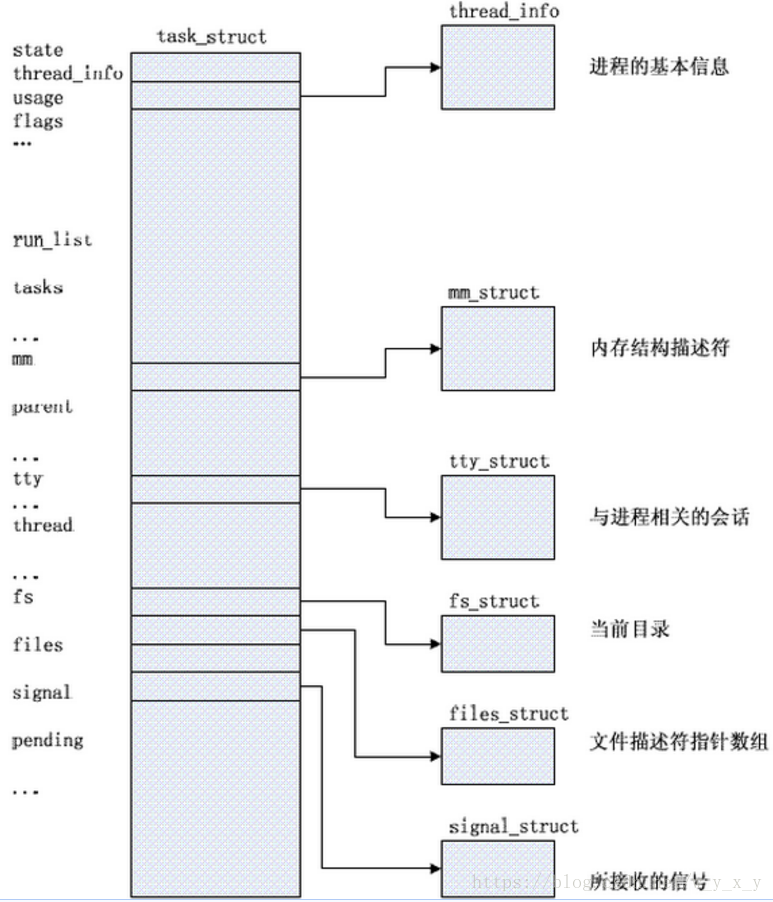
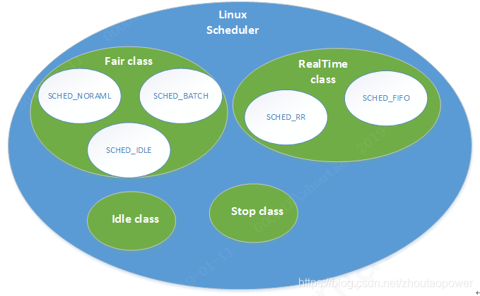
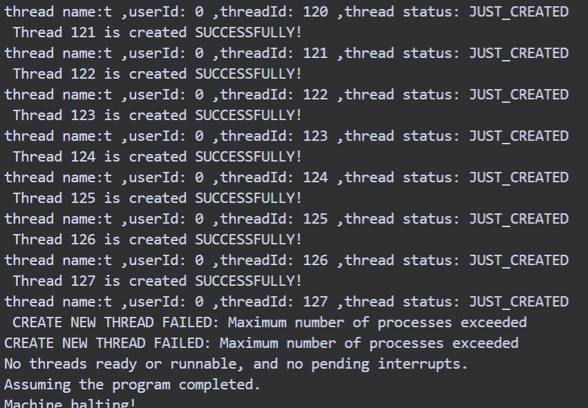
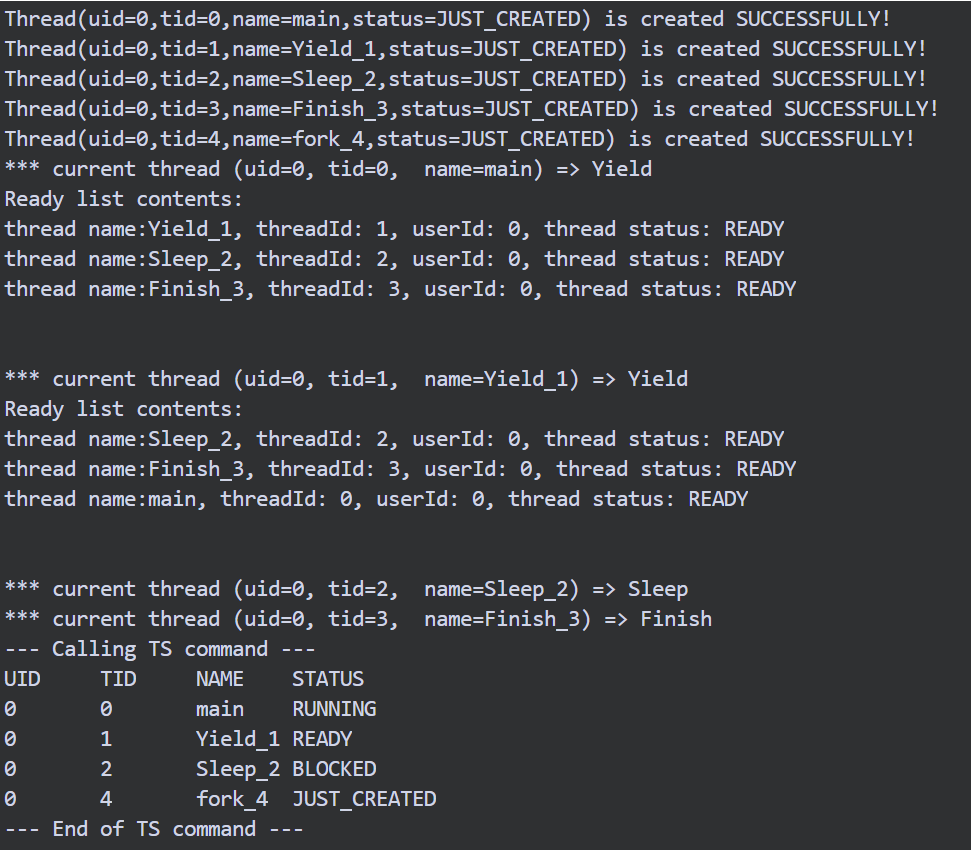
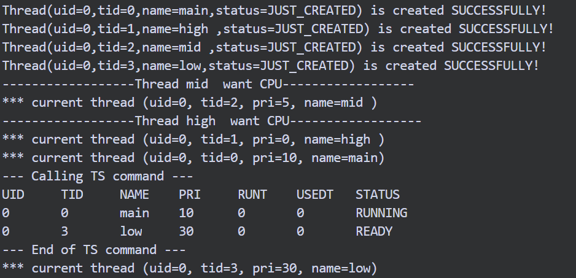
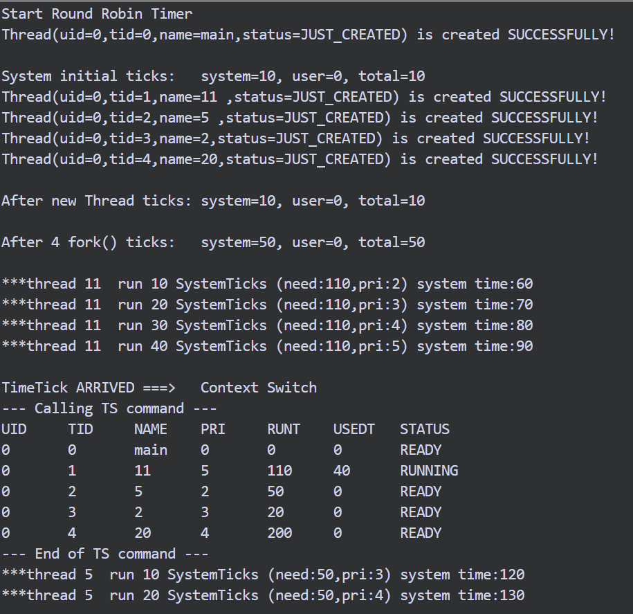

# 线程机制及调度

[TOC]


## 总体概述

​     本实验主要分为两个部分，第一部分是线程机制，第二部分是调度策略。需要掌握线程、中断、调度算法等概念，通过阅读理解改Nachos系统平台的底层源代码，对原生机制的工作原理有一个清晰的认知。在此基础上修改源代码，更改调度和中断工作方式，从而扩展线程模型和调度算法。


## 调研

### Linux中的PCB

​      我调研了Linux中的进程控制块的实现方式。Linux中的PCB叫做task_struct， 我阅读的5.9.2版本源码在/include/linux/sched.h中定义。task_struct包含了很多内容，其中比较重要的有以下几个部分：

- 标识符（PID）：进程的唯一标识

- 进程状态：有关进程运行情况的标志，状态比较多，包括状态（TASK_RUNNING（可运行）、TASK_INTERRUPTIBLE（可中断）、TASK_UNINTERRUPTIBLE（不可中断）、TASK_DEAD（死亡））和退出状态（EXIT_ZOMBIE（僵尸态））等等。

- 调度信息：包括进程的优先级、采用哪种调度策略

- 通信信息：包括管道（pipe_inode_info）、信号（signal_struct）、共享内存、信号量和消息队列等。

- 进程链接信息：很多指针，用于管理进程间关系。

-  时间和定时器信息：记录了进程占用CPU的时间。

- 文件系统信息：进程打开和关闭的文件的信息。

- 虚拟内存信息：管理进程的地址空间（mm_struct）。

- 页面管理信息：记录物理内存不足时进行交换时的信息。

-  处理器相关信息：如中断时处理器的上下文环境。



（图片来自：https://blog.csdn.net/w_y_x_y/article/details/80016975） 

### 与Nachos的异同

​      Nachos相比Linux就要简单很多了，仅仅包含了几个必要的信息和基本操作，定义在code/thread/thread.h文件中，包括运行栈（stackTop、stack）、上下文切换的寄存器状态（machineState）、进程状态（status）、进程名（name）。

 

### Linux的进程调度算法

​      Linux把进程分为实时进程和普通进程，普通进程通过nice值[-20,19]来描述优先级，nice值越大优先级越低，实时进程通过value[0,99]描述，value越大优先级越高，并且实时进程的优先级总高于普通进程。

​      通过选择不同的调度器类（scheduler class），Linux可以执行不同的调度策略，分为Idle class、Fair calss、RealTime class、Stop class，优先级从低到高，其中最常用的是Fair calss、RealTime class。Fair调度采用CFS（完全公平调度算法），实时调度采用SCHED_FIFO 和 SCHED_RR，即先入先出和时间片轮转算法。

​     进程可以自愿交出CPU，也可以被强制抢占CPU。



（图片来自：https://blog.csdn.net/zhoutaopower/article/details/86290196）


## Exercise 1 源代码阅读

仔细阅读下列源代码，理解Nachos现有的线程机制。

- code/threads/main.cc和code/threads/threadtest.cc

-  code/threads/thread.h和code/threads/thread.cc


​      Nachos在线程部分有几个比较重要的全局变量：currentThread、threadToBeDestroyed、scheduler、interrupt。currentThread和threadToBeDestroyed都是Thread * 类型的指针，分别指向当前正在运行的线程和需要被销毁的线程，scheduler负责线程的调度，其中有个重要的私有数据成员readyList，记录了所有处于READY的线程，interrupt负责中断的处理，在Exercise 4 部分再做详细说明。通过这些变量，Nachos就可以管理线程各个状态的切换。

​      main.cc包含了一些引导代码，根据命令行参数初始化系统，包括线程、用户程序、文件系统、网络、中断处理、定时器、调度机制等。在main()函数中设置testnum并启动Threadtest()来决定哪个线程相关的测试被执行。

​	我们可以在threadtest.cc中定义一些测试代码，并通过修改testnum来决定哪个测试程序被启用。

​	thread.h定义了管理线程需要的数据结构（线程控制块）包括：程序计数器、处理器寄存器、运行栈。定义线程状态有JUST_CREATED,RUNNING, READY, BLOCKED 。

​	thread.cc定义了管理线程的一些操作，最重要的有四个：Fork、Finish、Yield、Sleep。

- Fork：为线程分配堆栈，修改当前thread对象的状态为READY并加入readyList中。

- Finish：fork运行的程序结束的时候调用，不会马上回收线程数据结构或运行栈，因为还在运行线程并且还在栈上。取而代之的是把threadToBeDestroyed指针指向当前线程，当运行不同线程的上下文环境时让Scheduler::Run()调用销毁器。

- Yield：如果有就绪的线程，放弃CPU，并将线程放到就绪队列的末尾，如果就绪队列中没有线程立即返回。

- Sleep：修改线程状态为BLOCKED，放弃CPU，但线程是阻塞的。如果就绪队列为空引发Idle中断。最终这个线程会被一些线程唤醒并进入就绪队列尾，能被重新调度。

 

## Exercise 2 扩展线程的数据结构

​     增加“用户ID、线程ID”两个数据成员，并在Nachos现有的线程管理机制中增加对这两个数据成员的维护机制。

 

## Exercise3 增加全局线程管理机制

​     在Nachos中增加对线程数量的限制，使得Nachos中最多能够同时存在128个线程；

​     仿照Linux中PS命令，增加一个功能TS(Threads Status)，能够显示当前系统中所有线程的信息和状态。

 

我把Exercise 2 和3 合起来做了。

在**thread\thread.h**中增加了两个数据成员，并为其增加公有的get和set方法。

·   uid_t userId;

·   int threadId;

在**thread\system.h**中定义最大线程数：

```c
#define MAX_THREAD_NUM 128 
```

bool tFlag[**MAX_THREAD_NUM**]数组用于记录threadId是否还有空闲，并在 system.cc: **Initialize()** 的时候初始化。

在**thread\thread.cc**的构造函数中判断进程数，如果有空闲则分配threadId，如果没有抛出异常。

```c
char *a = "CREATE NEW THREAD FAILED: Maximum number of processes exceeded \n";
```

并在调用处捕获异常：

```c
 try{

Thread *t = new Thread("t");

}catch(const char* msg){printf(msg); }

userId通过Linux系统的getuid()接口获取并分配给线程。

 #if defined linux  //linux system 

  userId=getuid(); 

#endif 
```

在析构函数中修改tFlag数组：
```c
  tFlag[this->threadId] = false;
```

测试创建130个进程，可以看到第129和第130个创建失败，且没有阻塞操作系统或者导致系统关闭：



 

### TS命令

在thread\system.cc中定义指针数组**Thread** * allThread[**MAX_THREAD_NUM**]，存储指向每个线程的指针们。（与tFlag数组相似）

在thread\thread.cc构造时分配指针并记录在allThread中，析构时置空。

在thread\thread.cc中增加TS()，打印所有线程信息。
```c
void TS(){

  const char* TStoString[] = {"JUST_CREATED", "RUNNING", "READY", "BLOCKED"};

  printf("UID\tTID\tNAME\tSTATUS\n");

  for (int i = 0; i < MAX_THREAD_NUM; i++) { 

​    if (tFlag[i]) {

​      printf("%d\t%d\t%s\t%s\n", allThread[i]->getUserId(), allThread[i]->getThreadId(), allThread[i]->getName(), TStoString[allThread[i]->getStatus()]);

​    }

  }

}
```

创建三个线程并执行Yield、Sleep、Finish三种操作，最后调用TS（）查看：



 

 

## Exercise 4 源代码阅读

​     仔细阅读下列源代码，理解Nachos现有的线程调度算法。

- code/threads/scheduler.h和code/threads/scheduler.cc

- code/threads/switch.s

- code/machine/timer.h和code/machine/timer.cc

 

Nachos的调度算法很简单就是**FIFO**。

### scheduler.cc中比较重要的方法：

-  ReadyToRun (Thread *thread) :将线程状态变成READY，但不运行，并追加到readyList。

-  Thread* FindNextToRun():返回下一个上CPU的线程，且该线程会被**移出**readyList。若不存在返回NULL。

-  void Run(Thread* nextThread):将CPU分配给nextThread，通过调用上下文切换操作SWITCH，保存旧线程状态，加载新线程的状态。这里会假定先前运行的线程已经变为阻塞态或就绪态。全局变量currentThread会指向nextThread。

 

### Timer.h和Timer.cc

Timer类模拟了一个硬件计时器，硬件计时器每X毫秒生成一次CPU中断，Timer类是每TimerTicks生成一次。

-  可用于实现时间分片，或用于使线程在特定时间段内进入睡眠状态。

-  通过调度每次*stats-> totalTicks*增加*TimerTicks*时发生的中断来模拟硬件计时器。

-   new Timer()会启动计时器，**到点调用用户程序**

Nachos在machine\stats.h中统计四种时间：
-  totalTicks   系统总运行时间

-  idleTicks    空闲的时间

-   systemTicks  系统代码运行时间

-   userTicks    用户代码运行时间

并定义了几种动作耗费的时间片单位：

-   用户级指令：**UserTick** 1 

-   中断重启：**SystemTick** 10

-   磁盘旋转一个扇区：**RotationTime** 500 

-   磁盘搜索超过一个磁道**：****SeekTime** 500 

-   读/写一个字符：**ConsoleTime** 100 

-   收/发一个packet:**NetworkTime** 100

-  两次时间中断间隔：**TimerTicks** 100

与Timer类非常相关的一个文件是machine/Interrupt.h和machine/Interrupt.cc，并且在Challenge中会用到，之后再做出说明。

 

## Exercise 5 线程调度算法扩展

​     扩展线程调度算法，实现基于优先级的抢占式调度算法。

 

### 基本思路

Ø 给线程增加priority数据成员，用于表示优先级

Ø priority越大，优先级越低

Ø 新建线程分配优先级，在插入就绪队列的时候有序插入。

Ø 如果新建线程优先级更高则抢占CPU。

 

### 实现

重载构造函数：
```c
Thread(char* threadName,int pri): priority (pri){//the same}

 Thread (char* threadName): Thread (threadName,10){//do nothing}
```

修改thread\scheduler.cc的ReadyToRun函数，改为按优先级插入，并且和当前线程优先级作比较。

```c
void

Scheduler::ReadyToRun (Thread *thread)

{

  DEBUG('t', "Putting thread %s on ready list.\n", thread->getName());

 

  thread->setStatus(READY);

  //readyList->Append((void *)thread);

  readyList->SortedInsert((void *)thread,thread->getPriority());

  //lab1 exercixe5 pri

  if(thread->getPriority() < currentThread->getPriority()){

​    currentThread->Yield();

  }

}
```

测试程序按照中(5)、高(0)、低(30)的优先级顺序创建线程（main的优先级为10）：



看到当mid线程fork的时候会抢占main线程的CPU，而high线程又会抢占mid线程的CPU。

 

## Challenge 线程调度算法扩展

​     可实现“时间片轮转算法”、“多级队列反馈调度算法”，或将Linux或Windows采用的调度算法应用到Nachos上。

 

这一部分主要理解Nachos的定时器Timer类的工作机制。实际上，Timer是基于中断也就是Interrupt类工作的。

### Timer::Timer(VoidFunctionPtr timerHandler, int callArg, bool doRandom)

会调用Interrupt::Schedule，并设置处理程序为TimerHandler，这会把当前中断加入pending队列（待完成的中断队列）。

而TimerHandler调用了Timer::TimerExpired()，TimerExpired又会调用Interrupt::Schedule，并设置处理程序为TimerHandler，并运行一次用户程序。

也就是说，启动Timer时，一个Timer中断加入到中断队列中去了，该中断触发时，其调用的TimerHandler又会给中断队列加入新的Timer中断，并运行一次用户程序。从而导致每个Timer Tick都会中断并调用用户程序。

### Interrupt类

用于模拟低级中断硬件的数据结构。使用（SetLevel）来启用或禁用中断。

为了模拟硬件，我们需要跟踪硬件设备将引起的所有中断以及应该在**何时**发生。

中断状态：IntOff(禁止) IntOn(开启)

机器状态： 空闲态IdleMode, 系统态SystemMode, 用户态UserMode

中断类型：TimerInt, DiskInt, ConsoleWriteInt, ConsoleReadInt, ElevatorInt, NetworkSendInt, NetworkRecvInt(时间设备、控制台输入输出、键盘、网络)

### Interrupt类中的重要方法：

- Schedule（）： 会把当前中断加入pending队列

-  CheckIfDue(bool advanceClock) ： 检查当前时间有无中断需要处理，有，则处理一个，无，则return false 。如果advanceClock为true，则当前CPU空闲，会走时钟到下一个中断点并处理。如果处理了一个中断会return true。

-  Idle（）： readyList为空的时候会调用此函数。检查pending中有无中断需要处理，无，则关机，有，则处理并切换到系统态。

-  **YieldOnReturn（）**：把yieldOnReturn置true。

-  **OneTick（）**：根据系统状态（系统态/用户态）走一个时间片（SystemTick /UserTick ），处理当前时间中断，检查 **yieldOnReturn** 决定是否要上下文切换（currentThread->**Yield**()）。

 

### 思路

-  系统启动同时启动Timer()并关联用户程序

-  用户程序要做什么？
调度下一个优先级高的线程上CPU，即进行上下文切换。【到点切换上下文】

-  测试程序中走时钟
若该线程还没有运行完，则**增加已运行时间**并**降低优先级**。
> - 注意此处时间片的单位不一样，时间片轮转时间是**TimerTicks** ，线程运行时间是**SystemTick** 
> - 线程每运行一个**SystemTick** 优先级会变低10，防止饥饿。

若分配给该线程的时间片用尽，则finish，并切换上下文。

【Nachos模拟的硬件计时器实际上就是手动拨动的，与真实时间无关。】

### 实现 

Thread增加两个成员变量，并重载了构造函数（thread运行时间以**SystemTick**为单位）：
```c
int runTime; //total time to finish a thread

 int usedTime = 0; //already used time

 Thread:: Thread(char* threadName,int pri,int rt):priority(pri),runTime(rt * SystemTick)  
```

Nachos源码中，通过-rs参数启动计时器，我们仿照Nachos源码中的Timer启动，在thread\system.cc中增加函数RRInterruptHandler（dummy参数没什么作用）,作用就是进行上下文切换：
```c
static void RRInterruptHandler(int dummy)

{  

  if (interrupt->getStatus() != IdleMode){

​    printf("\nTimeTick ARRIVED ===>  Context Switch\n");

​    interrupt->YieldOnReturn(); 

  }

}
```
 

并在thread\main.cc:**Initialize(int argc, char** ********argv)**中的合适位置增加以下代码，作用是通过-rr参数启动时间片轮转调度：
```c
bool roundRobin = FALSE;

//……

else if (!strcmp(*argv, "-rr")) {

​      ASSERT(argc > 1);

​    roundRobin = TRUE;

​      argCount = 2;

​    }

//……

  if(roundRobin)

  timer = new Timer(RRInterruptHandler,0,FALSE);
```
 

在每个线程中，要做如下事情：

-   如果线程还有剩余运行时间，则：
1. 增加一个SystemTick的已运行时间
2. 降低线程优先级(每运行一次加一)
3. 走时钟OneTick()

-   如果线程运行完毕，finish（）
```c
void ThreadRR(int dummy){

  int ut = currentThread->getUsedTime();

  int rt = currentThread->getRunTime();

  while(ut < rt){

​     ut += SystemTick;

​     currentThread->setUsedTime(ut);  //increase used time

​    currentThread->setPriority(currentThread->getPriority() + PRI_DEGRADE); //drop pri 

​      interrupt->OneTick();

​    }

​    currentThread->Finish(); 

}

 ```

测试程序创建四个线程，并赋予不同的优先级和时间片。

```c
void RRTest(){

   DEBUG('t', "Entering Lab1 challenge");

   printf("\nSystem initial ticks:\tsystem=%d, user=%d, total=%d\n", stats->systemTicks, stats->userTicks, stats->totalTicks);

  Thread *t1 = new Thread("11 ",10,11);

  Thread *t2 = new Thread("5 ",20,5);

  Thread *t3 = new Thread("2",30,2);

  Thread *t4 = new Thread("20",30,20);

  printf("\nAfter new Thread ticks:\tsystem=%d, user=%d, total=%d\n", stats->systemTicks, stats->userTicks, stats->totalTicks);

  t1->Fork(ThreadRR, (void*)0);

  t2->Fork(ThreadRR, (void*)0);

  t3->Fork(ThreadRR, (void*)0);

  t4->Fork(ThreadRR, (void*)0);

  printf("\nAfter 4 fork() ticks:\tsystem=%d, user=%d, total=%d\n\n", stats->systemTicks, stats->userTicks, stats->totalTicks);

  currentThread->Yield();

}

```

启动命令： ./nachos -rr -q 5 ， 结果示意：



系统启动耗费1个时间，新建四个线程不耗费时间，fork四个线程耗费40个时间。

完整结果见[附录](#附录)。


## 遇到的困难以及解决方法

### 1.抢占

开始我给Thread增加了priority成员，并更改了插入就绪队列时按优先级有序插入。但是这并不是抢占式的，整个线程还是通过自身自愿让出CPU（即Yield）来让新线程运行。后来我修改了schedule的ReadyToRun函数，在新线程创建的时候会立即跟当前线程做比较，如果优先级更高立即要求上CPU。

但这里还存在一个问题，就是优先级高的线程会一直在CPU上运行至结束，那么会导致别的线程饥饿，这个问题怎么解决我还没有想出来，目前的想法是配合定时器，每个SystemTick后优先级降低，重新和readyList中的线程排序，选择调度。

### 2.定时器

开始没有理解Nachos的定时器与真实的时间没有关联，并且虚拟时间仅在发生以下情况时才会前进：

- 重新启用中断

- 执行一条用户指令

- readyList是空的

因此，与真正的硬件不同，中断（以及时间片上下文切换）不能在**启用了中断**的代码中的任何位置发生，而只能在代码中**模拟时间前进**的那些位置发生（这样就是时间的流逝）在硬件仿真中调用中断。

并且，中断发生的时机是与stats->totalTicks配合判断的。

    

## 参考文献

[1] Andrew S. Tanenbaum著．陈向群 马洪兵 译 .现代操作系统［Ｍ］．北京：机械工业出版社，2011：47-95．

[2] Nachos Doc: http://homes.cs.washington.edu/~tom/nachos/

[3] https://blog.csdn.net/w_y_x_y/article/details/80016975）  

 
## 附录
 
<pre lang="txt">
    <code>
//运行./nachos -rr -q 5  

Start Round Robin Timer

Thread(uid=0,tid=0,name=main,status=JUST_CREATED) is created SUCCESSFULLY!

 

System initial ticks:  system=10, user=0, total=10

Thread(uid=0,tid=1,name=11 ,status=JUST_CREATED) is created SUCCESSFULLY! 

Thread(uid=0,tid=2,name=5 ,status=JUST_CREATED) is created SUCCESSFULLY! 

Thread(uid=0,tid=3,name=2,status=JUST_CREATED) is created SUCCESSFULLY! 

Thread(uid=0,tid=4,name=20,status=JUST_CREATED) is created SUCCESSFULLY! 

 

After new Thread ticks: system=10, user=0, total=10

 

After 4 fork() ticks:  system=50, user=0, total=50

 

***thread 11 run 10 SystemTicks (need:110,pri:2) system time:60

***thread 11 run 20 SystemTicks (need:110,pri:3) system time:70

***thread 11 run 30 SystemTicks (need:110,pri:4) system time:80

***thread 11 run 40 SystemTicks (need:110,pri:5) system time:90

 

TimeTick ARRIVED ===>  Context Switch

--- Calling TS command ---

UID   TID   NAME  PRI   RUNT  USEDT  STATUS

0    0    main  0    0    0    READY

0    1    11   5    110   40   RUNNING

0    2    5    2    50   0    READY

0    3    2    3    20   0    READY

0    4    20   4    200   0    READY

--- End of TS command ---

No test specified.

***thread 5 run 10 SystemTicks (need:50,pri:3) system time:120

***thread 5 run 20 SystemTicks (need:50,pri:4) system time:130

***thread 5 run 30 SystemTicks (need:50,pri:5) system time:140

***thread 5 run 40 SystemTicks (need:50,pri:6) system time:150

***thread 5 run 50 SystemTicks (need:50,pri:7) system time:160

 

FINISHED THREAD 5  ! (total:50,used:50)

 

--- Calling TS command ---

UID   TID   NAME  PRI   RUNT  USEDT  STATUS

0    0    main  0    0    0    BLOCKED

0    1    11   5    110   40   READY

0    2    5    7    50   50   RUNNING

0    3    2    3    20   0    READY

0    4    20   4    200   0    READY

--- End of TS command ---

***thread 2 run 10 SystemTicks (need:20,pri:4) system time:180

***thread 2 run 20 SystemTicks (need:20,pri:5) system time:190

 

TimeTick ARRIVED ===>  Context Switch

--- Calling TS command ---

UID   TID   NAME  PRI   RUNT  USEDT  STATUS

0    0    main  0    0    0    BLOCKED

0    1    11   5    110   40   READY

0    2    5    7    50   50   BLOCKED

0    3    2    5    20   20   RUNNING

0    4    20   4    200   0    READY

--- End of TS command ---

***thread 20 run 10 SystemTicks (need:200,pri:5) system time:210

***thread 20 run 20 SystemTicks (need:200,pri:6) system time:220

***thread 20 run 30 SystemTicks (need:200,pri:7) system time:230

***thread 20 run 40 SystemTicks (need:200,pri:8) system time:240

***thread 20 run 50 SystemTicks (need:200,pri:9) system time:250

***thread 20 run 60 SystemTicks (need:200,pri:10) system time:260

***thread 20 run 70 SystemTicks (need:200,pri:11) system time:270

***thread 20 run 80 SystemTicks (need:200,pri:12) system time:280

***thread 20 run 90 SystemTicks (need:200,pri:13) system time:290

 

TimeTick ARRIVED ===>  Context Switch

--- Calling TS command ---

UID   TID   NAME  PRI   RUNT  USEDT  STATUS

0    0    main  0    0    0    BLOCKED

0    1    11   5    110   40   READY

0    2    5    7    50   50   BLOCKED

0    3    2    5    20   20   READY

0    4    20   13   200   90   RUNNING

--- End of TS command ---

***thread 11 run 50 SystemTicks (need:110,pri:6) system time:310

***thread 11 run 60 SystemTicks (need:110,pri:7) system time:320

***thread 11 run 70 SystemTicks (need:110,pri:8) system time:330

***thread 11 run 80 SystemTicks (need:110,pri:9) system time:340

***thread 11 run 90 SystemTicks (need:110,pri:10) system time:350

***thread 11 run 100 SystemTicks (need:110,pri:11) system time:360

***thread 11 run 110 SystemTicks (need:110,pri:12) system time:370

 

FINISHED THREAD 11 ! (total:110,used:110)

 

--- Calling TS command ---

UID   TID   NAME  PRI   RUNT  USEDT  STATUS

0    0    main  0    0    0    BLOCKED

0    1    11   12   110   110   RUNNING

0    3    2    5    20   20   READY

0    4    20   13   200   90   READY

--- End of TS command ---

 

FINISHED THREAD 2 ! (total:20,used:20)

 

--- Calling TS command ---

UID   TID   NAME  PRI   RUNT  USEDT  STATUS

0    0    main  0    0    0    BLOCKED

0    3    2    5    20   20   RUNNING

0    4    20   13   200   90   READY

--- End of TS command ---

 

TimeTick ARRIVED ===>  Context Switch

--- Calling TS command ---

UID   TID   NAME  PRI   RUNT  USEDT  STATUS

0    0    main  0    0    0    BLOCKED

0    4    20   13   200   90   RUNNING

--- End of TS command ---

***thread 20 run 100 SystemTicks (need:200,pri:14) system time:410

***thread 20 run 110 SystemTicks (need:200,pri:15) system time:420

***thread 20 run 120 SystemTicks (need:200,pri:16) system time:430

***thread 20 run 130 SystemTicks (need:200,pri:17) system time:440

***thread 20 run 140 SystemTicks (need:200,pri:18) system time:450

***thread 20 run 150 SystemTicks (need:200,pri:19) system time:460

***thread 20 run 160 SystemTicks (need:200,pri:20) system time:470

***thread 20 run 170 SystemTicks (need:200,pri:21) system time:480

***thread 20 run 180 SystemTicks (need:200,pri:22) system time:490

 

TimeTick ARRIVED ===>  Context Switch

--- Calling TS command ---

UID   TID   NAME  PRI   RUNT  USEDT  STATUS

0    0    main  0    0    0    BLOCKED

0    4    20   22   200   180   RUNNING

--- End of TS command ---

***thread 20 run 190 SystemTicks (need:200,pri:23) system time:510

***thread 20 run 200 SystemTicks (need:200,pri:24) system time:520

 

FINISHED THREAD 20 ! (total:200,used:200)

 

--- Calling TS command ---

UID   TID   NAME  PRI   RUNT  USEDT  STATUS

0    0    main  0    0    0    BLOCKED

0    4    20   24   200   200   RUNNING

--- End of TS command ---

No threads ready or runnable, and no pending interrupts.

Assuming the program completed.

Machine halting!

 

Ticks: total 600, idle 70, system 530, user 0

Disk I/O: reads 0, writes 0

Console I/O: reads 0, writes 0

Paging: faults 0

Network I/O: packets received 0, sent 0

 

Cleaning up...

     </code>
</pre>