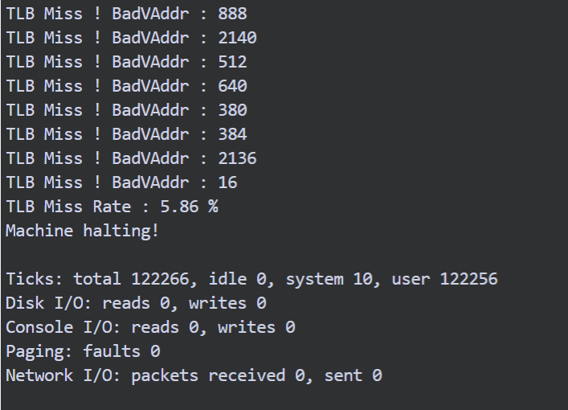
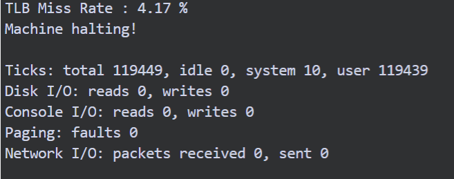
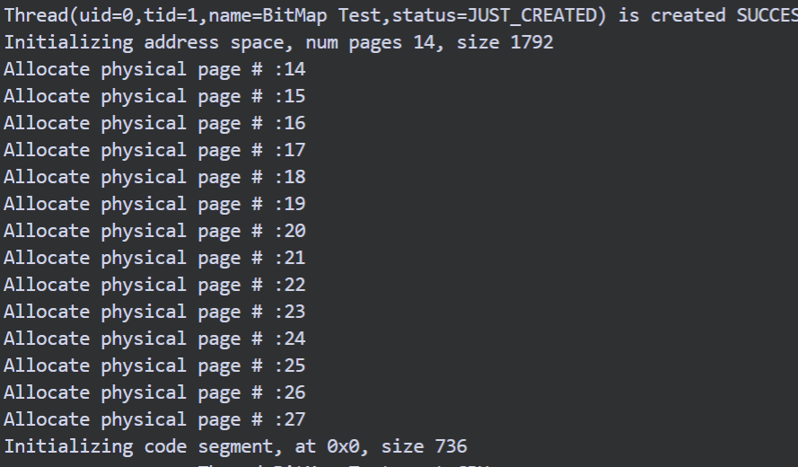
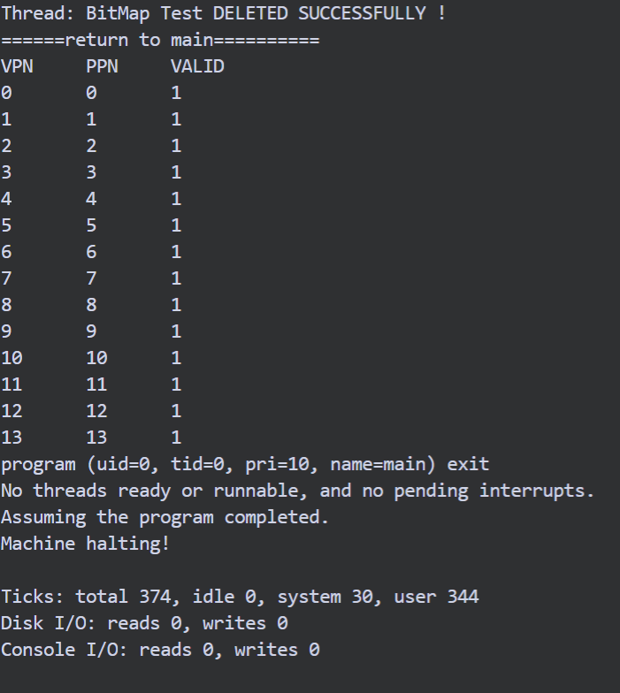
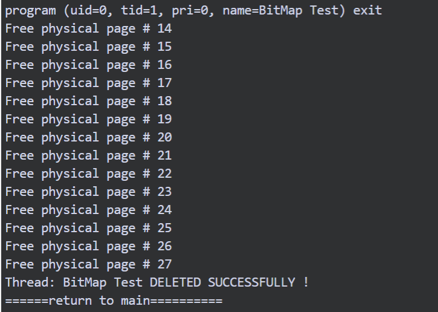
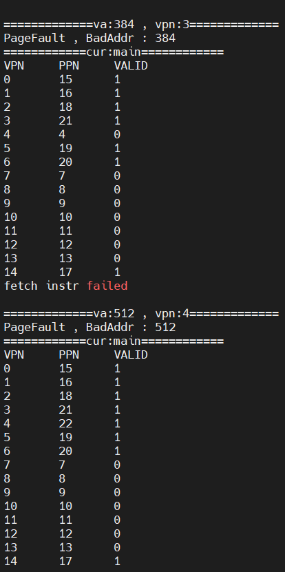

 

# 虚存管理
- [背景](#--)
- [TLB 异常处理](#tlb-----)
  * [Exercise 1 源代码阅读](#exercise-1------)
  * [Exercise 2 TLB MISS异常处理](#exercise-2-tlb-miss----)
  * [Exercise 3 置换算法](#exercise-3-----)
    + [命中率](#---)
    + [FIFO](#fifo)
    + [LRU](#lru)
- [分页式内存管理](#-------)
  * [Exercise 4 内存全局管理数据结构](#exercise-4-----------)
  * [Exercise 5 多线程支持](#exercise-5------)
  * [Exercise 6  缺页中断处理](#exercise-6--------)
- [Lazy-loading](#lazy-loading)
  * [Exercise 7](#exercise-7)
- [Challenges](#challenges)
  * [Challenge 1](#challenge-1)
  * [Challenge 2](#challenge-2)

## 背景

目前，Nachos系统所实现的内存管理模块中，虽然存在地址转换机制，但是却没有实现真正的虚拟内存。

Nachos系统的内存分配必须在用户程序载入内存时一次性完成，故此，系统能够运行的用户程序的大小被严格限制(32 * 128 B = 4KB，在Nachos系统中物理内存的页面大小PageSize为128 B，而每个用户程序最多只能获得32个物理页面，一旦超出则将导致系统出错)。

但是现代操作系统对内存管理的要求是支持多道程序，并且使得对任一程序而言，可用的内存空间应当是无限的，即需实现虚拟内存。同时还要提供存储保护机制。


## TLB 异常处理

目前，Nachos系统对于内存的管理是基于软件模拟的TLB机制。其工作原理、异常处理、替换算法等方面，与分页式内存管理非常相像。

### Exercise 1 源代码阅读

-  阅读code/userprog/progtest.cc，着重理解nachos执行用户程序的过程，以及该过程中与内存管理相关的要点。

-  阅读code/machine目录下的machine.h(cc)，translate.h(cc)文件和code/userprog目录下的exception.h(cc)，理解当前Nachos系统所采用的TLB机制和地址转换机制。

### Exercise 2 TLB MISS异常处理

修改code/userprog目录下exception.cc中的ExceptionHandler函数，使得Nachos系统可以对TLB异常进行处理（TLB异常时，Nachos系统会抛出PageFaultException，详见code/machine/machine.cc）。

启用TLB
在userprog/MakeFile中增加:
<code>DEFINES =   -DUSE_TLB</code>  
由于PageFaultException无法区分是页表Miss还是TLB Miss，因此在 machine/machine.h 的ExceptionType中增加异常类型TLBException

在ExceptionHandler中处理该异常：
```c
        //Lab2 TLB exception handle
     if (which == PageFaultException) {
         // linear page table page fault
            DEBUG('m', "=> Page table page fault.\n");
            ASSERT(FALSE);
	//ASSERT(FALSE);
    }
    else if(which == TLBException)
    { // TLB miss (no TLB entry)
            DEBUG('m', "=> TLB miss (no TLB entry)\n");
            int BadVAddr = machine->ReadRegister(BadVAddrReg); // The failing virtual address on an exception
            TLBMissHandler(BadVAddr);
    }
    
```

**注意**

在<code>test/sort.c</code>中没有实现Exit系统调用，为了方便之后的实验，这里先对其简单实现。
Exit系统调用在<code>userprog/syscall.h</code>中定义，而在<code>userprog/exception.cc</code>中实现，在处理异常之后要PC+4。
```c

void IncrementPCRegs(void) {
    // Debug usage
    machine->WriteRegister(PrevPCReg, machine->ReadRegister(PCReg));

    // Advance program counter
    machine->WriteRegister(PCReg, machine->ReadRegister(NextPCReg));
    machine->WriteRegister(NextPCReg, machine->ReadRegister(NextPCReg)+4);
}


void
ExceptionHandler(ExceptionType which)
{
    //...

    else if((which == SyscallException) && (type == SC_Exit)){
            
        IncrementPCRegs();
        currentThread->Finish();
    }
    //...
    
}
```

### Exercise 3 置换算法

为TLB机制实现至少两种置换算法，通过比较不同算法的置换次数可比较算法的优劣。


Nachos中TLB大小为4，和Page Table的使用同一结构，

|vpn | ppn | valid | readOnly | use | dirty |
|-|-|-|-|-|-|

TLB机制流程为：根据请求的虚拟页号，在TLB中查找
- 若命中，直接读出页框号
- 若没有命中，从Page Table中查找，找到后，若TLB还有空项直接写入，若已满则对TLB进行置换（当前情况一定会在Page Table中找到，不涉及缺页中断）

#### 命中率
为了统计不同置换算法的命中率，在<code>machine/machine.h</code>设置变量TLBMiss和TLBHit，在ReadMem和WriteMem的时候更新，最终在ExecptionHandler中处理Halt异常的时候统计命中率。

这里实现FIFO和LRU置换算法。


#### FIFO

**基本思想**

当需要淘汰一个页面时，总是选择驻留主存时间最长的页面进行淘汰，即先进入主存的页面先淘汰。


**具体实现**

每次把移除TLB的首项，并把后面的项依次前移:
```c


void TLBAlgoFIFO(TranslationEntry page)
{
    int TLBreplaceIdx = -1;
    // Find the empty entry
    for (int i = 0; i < TLBSize; i++) {
        if (machine->tlb[i].valid == FALSE) {
            TLBreplaceIdx = i;
            break;
        }
    }
    // If full then move everything forward and remove the last one
    if (TLBreplaceIdx == -1) {
        TLBreplaceIdx = TLBSize - 1;
        for (int i = 0; i < TLBSize - 1; i++) {
            machine->tlb[i] = machine->tlb[i+1];
        }
    }
    // Update TLB
    machine->tlb[TLBreplaceIdx] = page;
}
```

**测试结果**



 #### LRU

**基本思想**

淘汰最后一次访问时间距离当前时间间隔最长的页面。

**具体实现**

给<code>machine/translate.h</code> 的 TranslationEntry增加一个count位，表示新旧，每次置换值最大的项。
- TLB命中
所在项赋值为1，tlb[i].count= 1；
- TLB没命中
若TLB有空项，插入
若TLB已满，选择值最大的置换，其他项值++

<code>machine/translate.cc</code>Translate()更新维护：
```c


//...

for (entry = NULL, i = 0; i < TLBSize; i++)
    if (tlb[i].valid && (tlb[i].virtualPage == vpn)) {
	entry = &tlb[i];			// FOUND!
	//----------Lab 2 TLB -------------
	TLBHit++;
	tlb[i].count = 1;
	//---------------------------------
	break;
	 }
    if (entry == NULL) {				// not found
	//------------------Lab2 TLB----------------
	TLBMiss++;
	for(int i = 0; i < TLBSize;++i){
		if (tlb[i].valid)   tlb[i].count ++;
        }
        //-----------------------------------------

    	    return TLBException;	
	}
//...
```

<code>userProg/exception.cc</code>
```c
void TLBAlgoLRU(TranslationEntry page){
    
    int TLBreplaceIdx = -1;
    // Find the empty entry
    for (int i = 0; i < TLBSize; i++) {
        if (machine->tlb[i].valid == FALSE) {
            TLBreplaceIdx = i;
            break;
        }
    }
    // If full then move everything forward and remove the last one
    if (TLBreplaceIdx == -1) {
        TLBreplaceIdx = TLBSize - 1;
        for (int i = 0; i < TLBSize - 1; i++) {
            if(machine->tlb[i].count  > machine->tlb[TLBreplaceIdx].count) {
                TLBreplaceIdx = i;
            }
        }
    }
    // Update TLB
    machine->tlb[TLBreplaceIdx] = page;

}
```

**测试结果**

 

## 分页式内存管理

目前Nachos系统中，类Class Thread的成员变量AddrSpace* space中使用TranslationEntry* pageTable来管理内存。应用程序的启动过程中，对其进行初始化；而在线程的切换过程中，亦会对该变量进行保存和恢复的操作（使得类Class Machine中定义的Class Machine::TranslationEntry* pageTable始终指向当前正在运行的线程的页表）。

### Exercise 4 内存全局管理数据结构

设计并实现一个全局性的数据结构（如空闲链表、位图等）来进行内存的分配和回收，并记录当前内存的使用状态。  

**思路**

使用位图将内存划分为页。
对应于每个页的是位图中的一个位，仅当该页空闲时为零（0），仅当该页被占用时为一（1）
直接使用Nachos内部实现的BitMap类完成。
在MakeFile中增加开关：-DUSE_BITMAP
在machine类中添加成员变量BitMap * bitmap，并在构造函数中初始化。

```c
Machine::Machine(bool debug)
{
    //-------Lab2  BITMAP-------
    #ifdef USE_BITMAP
    bitmap = new BitMap(NumPhysPages);
    #endif
    //...
}

```

分配地址空间时 ，调用Find()寻找空闲页：

```c
 #ifdef USE_BITMAP    
    pageTable[i].physicalPage = machine->bitmap->Find();
    #else
    pageTable[i].physicalPage = i;
    #endif
```

在AddrSpace析构函数 中回收空间：

```c

    #ifdef USE_BITMAP
    for(int i = 0; i < numPages;++i){
        if(pageTable[i].valid){
            machine->bitmap->Clear(pageTable[i].physicalPage);
            printf("Free physical page # %d \n",pageTable[i].physicalPage);
        }
    }

    #endif
```
**测试结果**

与Excercise 5 一起测试。


### Exercise 5 多线程支持

目前Nachos系统的内存中同时只能存在一个线程，我们希望打破这种限制，使得Nachos系统支持多个线程同时存在于内存中。

在Execise 4中实现了用BitMap管理主存，原生的Nachos的页框号等于页号，这里在<code>userprog/addrspace.cc</code>分配地址空间时


```c

AddrSpace::AddrSpace(OpenFile *executable)
{
    //...
    for (i = 0; i < numPages; i++) {
	pageTable[i].virtualPage = i;	// for now, virtual page # = phys page #
    #ifdef USE_BITMAP    
    pageTable[i].physicalPage = machine->bitmap->Find();
    #else
    pageTable[i].physicalPage = i;
    #endif
    printf("Allocate physical page # :%d \n",pageTable[i].physicalPage);
    //...
    }
   //----------注意，注释掉这一行-------------
  //  bzero(machine->mainMemory, size);

// then, copy in the code and data segments into memory
    if (noffH.code.size > 0) {
       //...
         //-----------Lab 2 BITMAP -------------
         int pos = noffH.code.inFileAddr;
         //一个字节一个字节写入
         for(int j = 0; j < noffH.code.size;++j){
             //vpn = va / pagesize
             int cur_vpn = (noffH.code.virtualAddr + j ) / PageSize;
             int cur_offset = (noffH.code.virtualAddr + j ) % PageSize;
             //paddr = ppn * pagesize + offset
             int paddr = pageTable[cur_vpn].physicalPage * PageSize + cur_offset;
             executable -> ReadAt(&(machine->mainMemory[paddr]),1,pos++);
         }   
    }
    if (noffH.initData.size > 0) {
          
         //-----------Lab 2 BITMAP -------------
         int pos = noffH.initData.inFileAddr;
         for(int j = 0; j < noffH.initData.size;++j){
             int cur_vpn = (noffH.initData.virtualAddr + j ) / PageSize;
             int cur_offset = (noffH.initData.virtualAddr + j ) % PageSize;
             int paddr = pageTable[cur_vpn].physicalPage * PageSize + cur_offset;
             executable -> ReadAt(&(machine->mainMemory[paddr]),1,pos++);
         }   
           
    }
    //...

}
```
同时，在地址转换时也要作出处理：
<code>userprog/translate.cc</code>
```c
ExceptionType Machine::Translate(int virtAddr, int* physAddr, int size, bool writing){
    //...
#ifdef USE_BITMAP 
	//printf("VPN\tPPN\tvalid\n");
	bool f = false;
	for(int i = 0; i < pageTableSize; ++i){
        
		if(pageTable[i].valid && vpn == pageTable[i].virtualPage){
			entry = &pageTable[i];
			f = true;
			break;
		}
	}	
	if(!f) {        
	    return PageFaultException;
	}	
    //...
}
```


**测试结果**


根据需求要测试一个线程结束时地址空间的回收情况，选择Lab1中实现的基于优先级的抢占式调度算法，在Lab2中，为了方便使用抢占式，我在<code>thread/MakeFile</code>中增加了-DUSE_PREEMPTIVE参数标志是否开启，并修改了相关代码。
在<code>progtest.cc</code>StartProcess()中Fork一个新线程，并为其分配地址空间。
```c

void BitMapThread(int dummy){
    machine->Run();		
   
}

void 
StartProcess(char *filename)
{
    //...
//-------Lab 2  BITMAP-------
 Thread *t = new Thread("BitMap Test",0);
 OpenFile *executable2 = fileSystem->Open(filename);
    AddrSpace *space2;

    if (executable2 == NULL) {
	printf("Unable to open file %s\n", filename);
	return;
    } 
    space2 = new AddrSpace(executable2);    
    t->space = space2;
    delete executable2;			// close file

    t->space->InitRegisters();		
    t->space->RestoreState();	
    t->Fork(BitMapThread,(void*)1);
    
    //t->Finish();
    printf("======return to main==========\n");	
     machine->Run();			
}
```
分配页框：

两个线程：

回收空间：




### Exercise 6  缺页中断处理

基于TLB机制的异常处理和页面替换算法的实践，实现缺页中断处理（注意！TLB机制的异常处理是将内存中已有的页面调入TLB，而此处的缺页中断处理则是从磁盘中调入新的页面到内存）、页面替换算法等。

**基本思路**
用文件“virtual_memory”模拟虚拟内存。
```c
 OpenFile *openfile = fileSystem->Open("virtual_memory");
    if(openfile == NULL )ASSERT(false);
```
当缺页中断时，若物理页有空闲，则直接分配，若没有空闲，简单的替换 0 # 物理页.
在替换时检查脏位是否设置，若设置要写回。
```c

    int vpn = (unsigned) machine->registers[BadVAddrReg] / PageSize;
    int pos = machine ->bitmap-> Find();
    if(pos == -1){
        pos = 0;
        for(int j = 0; j < machine -> pageTableSize;++j){
            if(machine->pageTable[j].physicalPage == 0){
                if(machine->pageTable[j].dirty == TRUE){
                    openfile -> WriteAt(&(machine->mainMemory[pos * PageSize]),PageSize,machine->pageTable[j].virtualPage * PageSize);
                }
                machine->pageTable[j].valid = FALSE;
                break;
            }
        }
    }
```
对machine的pageTable对应页进行修改。

```c
    openfile -> ReadAt(&(machine->mainMemory[pos * PageSize]),PageSize,vpn * PageSize);
    machine->pageTable[vpn].valid = TRUE;
    machine->pageTable[vpn].physicalPage = pos;;
    machine->pageTable[vpn].use = FALSE;
    machine->pageTable[vpn].dirty = FALSE;
    machine->pageTable[vpn].readOnly - FALSE;
    delete openfile;
```

测试与Exercise 7 一起进行。

## Lazy-loading

### Exercise 7 
我们已经知道，Nachos系统为用户程序分配内存必须在用户程序载入内存时一次性完成，故此，系统能够运行的用户程序的大小被严格限制在4KB以下。请实现Lazy-loading的内存分配算法，使得当且仅当程序运行过程中缺页中断发生时，才会将所需的页面从磁盘调入内存。

通过-DUSE_PAGE开启lazy-loading  
在<code>userprog/addrspace.cc</code>初始分配页表的时候至valid为False.
建立虚拟内存,并把内容拷贝进去，注意写入的起始地址是：noffH.initData.**virtualAddr** 。

 ```c
 
// Create a virtual memory with the size that the executable file need.
    bool success_create_vm = fileSystem->Create("VirtualMemory", size);
    ASSERT(success_create_vm);

    OpenFile *vm = fileSystem->Open("VirtualMemory");

// then, copy in the code and data segments into memory

    if (noffH.code.size > 0) {

         //-----------Lab 2 BITMAP -------------
         int pos = noffH.code.inFileAddr;
         int vm_addr = noffH.code.virtualAddr ;
         char virtualMemory_temp;
         for(int j = 0; j < noffH.code.size;++j){
             int cur_vpn = (noffH.code.virtualAddr + j ) / PageSize;
             int cur_offset = (noffH.code.virtualAddr + j ) % PageSize;
             executable -> ReadAt(&(virtualMemory_temp),1,pos++);
             vm->WriteAt(&(virtualMemory_temp),1,vm_addr++);
             
         }   
    }
    if (noffH.initData.size > 0) {
         //-----------Lab 2 BITMAP -------------
         int pos = noffH.initData.inFileAddr;
         int vm_addr = noffH.initData.virtualAddr ;
         char virtualMemory_temp;
         for(int j = 0; j < noffH.initData.size;++j){
             int cur_vpn = (noffH.initData.virtualAddr + j ) / PageSize;
             int cur_offset = (noffH.initData.virtualAddr + j ) % PageSize;
             executable -> ReadAt(&(virtualMemory_temp),1,pos++);
             vm->WriteAt(&(virtualMemory_temp),1,vm_addr++);
        
         }   
           
    }
    delete vm;
}
 ```

 注意，为了方便这里只开启了一个线程，若要开启多个线程，需要为每个线程都建立virtual_memory，要注意文件名重复问题。

 **测试结果**

 
 可以看到在每次缺页后的中断处理，页表发生置换。

## Challenges

### Challenge 1  
为线程增加挂起SUSPENDED状态，并在已完成的文件系统和内存管理功能的基础之上，实现线程在“SUSPENDED”，“READY”和“BLOCKED”状态之间的切换。

### Challenge 2  
多级页表的缺陷在于页表的大小与虚拟地址空间的大小成正比，为了节省物理内存在页表存储上的消耗，请在Nachos系统中实现倒排页表。

**基本思路**

倒排页表是从物理地址开始建立映射.
在MakeFile中设置INVERTED_PAGETABLE标志是否开启倒排页表，此时bitmap和倒排页表不能共存，关闭USE_BITMAP标志
只用保留machine的一张页表，增加线程id数据成员
```c
class TranslationEntry {

   // ...

#ifdef INVERTED_PAGETABLE // Lab4: Inverted Page Table
    int threadId;
#endif
};
```

为进程分配页框时，寻找未初始化的页框：

```c
int
Machine::allocateFrame(void)
{
    for (int i = 0; i < NumPhysPages; i++) {
        if (!pageTable[i].valid) {
            return i;
        }
    }
    return -1;
}
```
回收空间：
```c
void
Machine::freeMem(void)
{
    for (int i = 0; i < NumPhysPages; i++) {
        if (pageTable[i].threadId == currentThread->getThreadId()) {
            pageTable[i].valid = FALSE;
        }
    }
}
```

在machine 的构造函数中初始化页表：
```c
Machine::Machine(bool debug){
    //...
 pageTable = new TranslationEntry[NumPhysPages];
    // Initialize Inverted Page Table
    for (i = 0; i < NumPhysPages; i++) {
        pageTable[i].physicalPage = i;
        pageTable[i].virtualPage = i;
        pageTable[i].valid = FALSE;
        pageTable[i].dirty = FALSE;
        pageTable[i].readOnly = FALSE;
        pageTable[i].threadId = -1;
    }
    pageTableSize = MemorySize;
    //...
}
    
```


 在分配地址时：
 ```c
 AddrSpace::AddrSpace(OpenFile *executable)
{
    //...

    for (i = 0; i < numPages; i++) {
        machine->pageTable[i].physicalPage = machine->allocateFrame(); 
        
        machine->pageTable[i].valid = TRUE;
        machine->pageTable[i].use = FALSE;
        machine->pageTable[i].dirty = FALSE;
        machine->pageTable[i].readOnly = FALSE;

        machine->pageTable[i].threadId = currentThread->getThreadId(); 
    }
    //...
}
 ```

地址转换判断是否为当前线程拥有的：
```c
ExceptionType
Machine::Translate(int virtAddr, int* physAddr, int size, bool writing)
{
    //...

    if (tlb == NULL) {
        if (vpn >= pageTableSize) {
            DEBUG('a', "virtual page # %d too large for page table size %d!\n",
                  virtAddr, pageTableSize);
            return AddressErrorException;
        } else if (!pageTable[vpn].valid) {
            DEBUG('a', "virtual page # %d is invalid!\n");
            return PageFaultException;
        } else if (!(pageTable[vpn].threadId == currentThread->getThreadId())) {
            ASSERT_MSG(FALSE, "A thread is accessing other thread's address space!");
        }
        entry = &pageTable[vpn];
    }

   // ...
}
```

**测试结果**

<code>
Initialized memory for thread "main".
User program exit with status 87
Free physical page frame: 0
Free physical page frame: 1
Free physical page frame: 2
Free physical page frame: 3
Free physical page frame: 4
Free physical page frame: 5
Free physical page frame: 6
Free physical page frame: 7
Free physical page frame: 8
Free physical page frame: 9
Free physical page frame: 10
Freed the memory hold by thread "main".
</code>

【实习建议】

1.   字节顺序

VMware虚拟机以及一般的PC机采用的是Little-Endian法字节顺序。

而Nachos模拟的处理器采用的则是Big-Endian法字节顺序。

请注意使用WordToMachine和ShortToMachine函数进行适当的转换。

2.   程序在地址空间的存放

在bin/noff.h中描述了程序的存放方式

-  Struct segment代表了程序的一个分段。

-  Struct noffHeader中定义了程序的代码段、已初始化的数据段和未初始化的数据段。

3.   仔细阅读下列源代码文件：

code/machine/machine.h和code/machine/machine.cc

code/machine/translate.h和code/machine/translate.cc.

code/userprog/addrspace.h和code/userprog/addrspace.cc

code/userprog/exception.h和code/userprog/ exception.cc