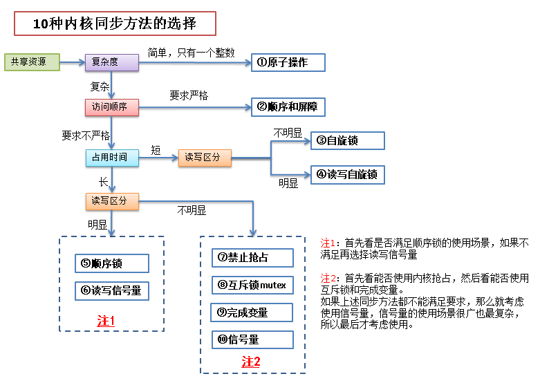
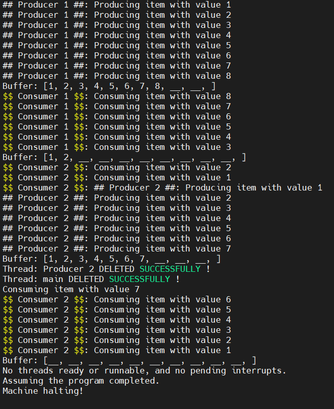
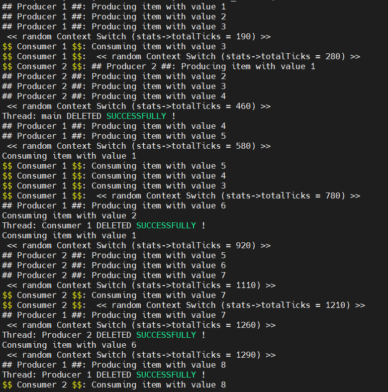
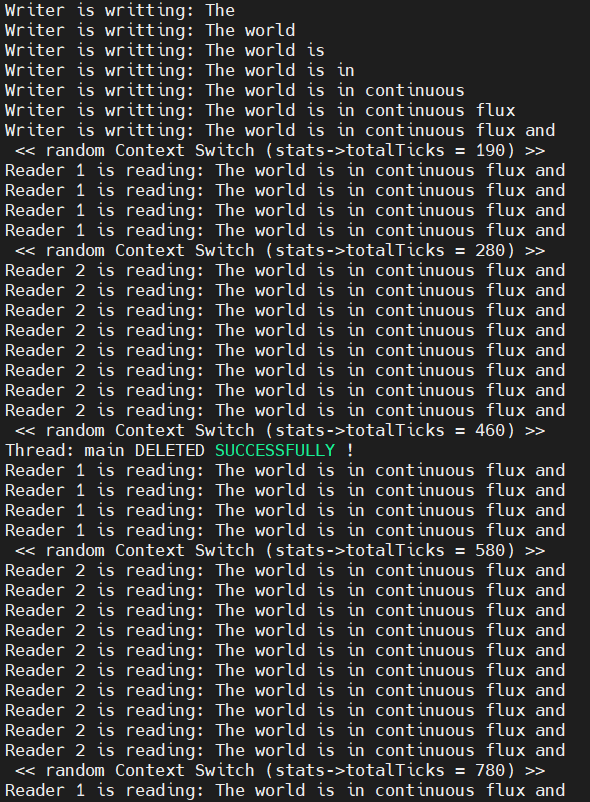
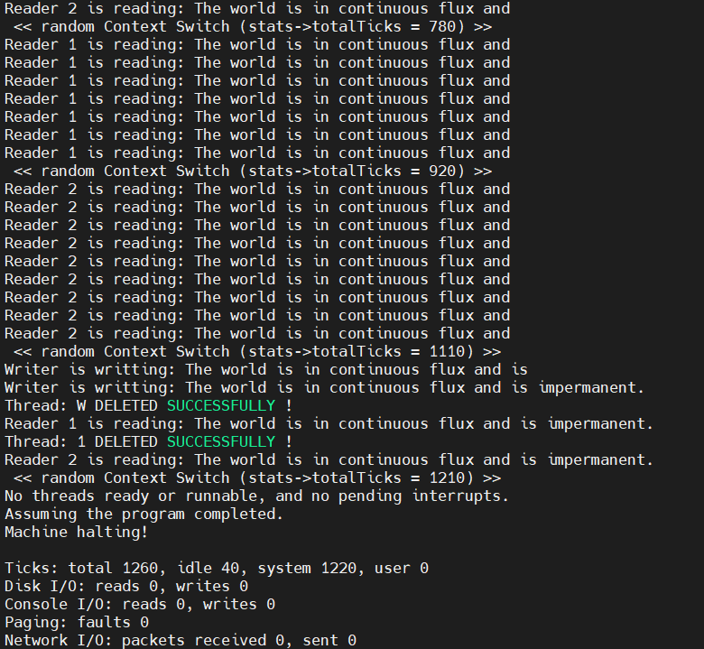

# Lab3 同步机制 实习说明

本实习希望通过修改Nachos系统平台的底层源代码，达到“扩展同步机制，实现同步互斥实例”的目标。

【实习内容】
- [Lab3 同步机制 实习说明](#lab3----------)
  * [Exercise 1  调研](#exercise-1----)
  * [Exercise 2  源代码阅读](#exercise-2-------)
    + [synch.h scynch.cc](#synchh-scynchcc)
    + [synchlist.h synchlist.cc](#synchlisth-synchlistcc)
  * [Exercise 3  实现锁和条件变量](#exercise-3----------)
    + [Lock](#lock)
      - [基本思路](#----)
      - [Acquire](#acquire)
      - [Realease](#realease)
    + [Condition](#condition)
      - [基本思路](#-----1)
      - [Wait](#wait)
      - [Signal](#signal)
      - [Broadcast](#broadcast)
  * [Exercise 4  实现同步互斥实例](#exercise-4----------)
    + [Buffer 有界缓冲区](#buffer------)
    + [Semaphore](#semaphore)
    + [Lock && Condition](#lock----condition)
  * [*Challenge 1  实现barrier（至少选做一个Challenge）](#-challenge-1----barrier-------challenge-)
  * [*Challenge 2  实现read/write lock](#-challenge-2----read-write-lock)
  * [*Challenge 3  研究Linux的kfifo机制是否可以移植到Nachos上作为一个新的同步模块。](#-challenge-3----linux-kfifo---------nachos------------)
  * [问题](#--)
  * [参考文献](#----)
  * [附录](#--)
    + [条件变量](#----)
      - [用处](#--)
      - [为什么和互斥锁一起使用](#-----------)
      - [优点](#--)


## Exercise 1  调研
调研Linux中实现的同步机制。具体内容见课堂要求。

|类型|机制|应用场合|
|-|-|-|
|spinlock|使用忙等方法，进程不挂起|(1)用于多处理器间共享数据<br>(2)在可抢占的内核线程里共享数据<br>(3)自旋锁适合于保持时间非常短的情况，它可以在任何上下文使用，比如中断上下文
|信号量|阻塞式等待，进程挂起|(1)适合于共享区保持时间较长的情况<br>(2)只能用于进程上下文|
|原子操作|数据的原子访问|(1)共享简单的数据类型：整型、比特型<br>(2)适合高效率的场合|
|rwlock|特殊的自旋锁|(1)允许同时读共享资源，但只能有一个写<br>(2)读优先于写，读写不能同时|
|顺序锁|一种免锁机制，基于访问计数|(1)允许同时读共享资源，但只能有一个写<br>(2)写优先于读，读写不能同时|
|RCU|通过副本的免锁访问|(1)对读占主要的场合提供高性能<br>(2)读访问不必获取锁，不必执行原子操作或禁止中断|
|关闭中断|通过禁止中断的手段，排除单处理器上的并发，会导致中断延迟|(1)中断与正常进程共享数据<br>(2)多个中断共享数据<br>(3)临界区一般很短|


## Exercise 2  源代码阅读
阅读下列源代码，理解Nachos现有的同步机制。
- code/threads/synch.h和code/threads/synch.cc
- code/threads/synchlist.h和code/threads/synchlist.cc

### synch.h scynch.cc
定义了用于线程同步的数据结构：信号量Semaphore、锁Lock、条件变量Condition。其中Nachos只实现了Semaphore，其他只给出了示例。
- Semaphore 
与信号量的定义一致，有用于表示资源是否可用的值value（恒 > 0），PV操作，和一个用于记录等待资源的线程的队列。
    - P()
      关中断
      若无资源，加入queue，Sleep，忙等
      否则value--
      设中断为原始值
    - V()
      关中断
      取queue中一个thread，放到就绪队列
      value++
      设中断为原始值
- Lock
请求锁/释放锁两个操作，isHeldByCurrentThread表示是否被当前线程所持有。
- Condition
有wait、signal、Broadcast三个操作，Broadcast将会唤醒所有等待此条件的线程。
Nachos采用Mesa风格语义，Signal和Wait只是将线程放入就绪队列，而具体获取锁的操作由线程完成。这样使得其他线程可以在其运行前获得锁并更改数据结构。
Nachos通过开关中断保证原子性。
### synchlist.h synchlist.cc
定义了用于同步访问List的数据结构，是通过将List的各种操作用同步例程包围起来实现的。
synchlist同步列表将符合以下约束：
1. 试图从List中删除元素的线程将等待直到有一个元素。
2. 一次只有一个线程可以访问列表数据结构

- Append
向List尾部加入一项，并唤醒等待remove操作的thread（如果有的话）
- Remove
移除队首，若空则等待
- Mapcar
向List中的每一项应用传入的函数


## Exercise 3  实现锁和条件变量
可以使用sleep和wakeup两个原语操作（注意屏蔽系统中断），也可以使用Semaphore作为唯一同步原语（不必自己编写开关中断的代码）。
### Lock
我使用Semaphore实现锁，方便对锁状态切换的操作。
#### 基本思路
- 锁由线程所持有，获取和释放锁的时候必须判断当前线程的权限。一个锁只能被获取到它的线程释放，而不能由别的线程释放。因此需要一个Thread类型的指针成员变量，保存持锁的线程。
- 锁有打开/关闭两种状态，状态的切换必须是原子性的，因此信号量的PV操作能够满足需求，创建一个二元的信号量。
- 为保证操作的原子性，操作前要关中断，操作完毕恢复原始值。后面不在赘述。
```c
    IntStatus oldLevel = interrupt->SetLevel(IntOff);	// disable interrupts
    (void) interrupt->SetLevel(oldLevel);	// re-enable interrupts
```
基于上述思路，向Lock类添加两个私有成员变量，并在构造函数中初始化信号量：
```c

    Thread * holderThread;     
    Semaphore * semaphore;   //use semaphore to implement lock
    //...
    Lock::Lock(char* debugName) {
    name = debugName;
    semaphore = new Semaphore("Lock",1);   // "1" means Free
}
```

#### Acquire
1. 等待锁
```c
semaphore->P();
```
2. 有资源后，当前进程持锁
```c
holderThread = currentThread;  
```
#### Realease
1. 判断当前进程是否持锁
```c
ASSERT(this->isHeldByCurrentThread());
```
2. 释放锁
```c
    holderThread = NULL;
    semaphore->V();
```
### Condition
使用Lock实现
#### 基本思路
- 条件变量就是两个（或者多个）线程需要碰头（一个线程给另外的一个或者多个线程发送消息），我们指定在条件变量这个地方发生。
- 一个线程用于修改这个变量使其满足其它线程继续往下执行的条件，其它线程则接收条件已经发生改变的信号。因此在没有达到条件的时候，需要的线程应被记录下来。
==>新增List * waitQueue成员变量，保存等待条件的所有线程。
- 每个操作前都要检查当前进程是否持锁
```c
    ASSERT(conditionLock->isHeldByCurrentThread())
```
#### Wait
1. 检查当前线程是否已经上锁
```c
    ASSERT(conditionLock->isLocked());
```
2. 等待条件时释放锁
```c
    conditionLock->Release();
```
3. 把当前线程加入waitQueue，并进入sleep状态
```c
    waitQueue->Append(currentThread);
    currentThread->Sleep();
```
4. 如果被唤醒，重新获取锁
```c
    conditionLock->Acquire();
```

#### Signal
若waitQueue不空，取队首线程放入就绪队列
```c
    if (!waitQueue->IsEmpty()) {
        Thread* thread = (Thread*) waitQueue->Remove();
        scheduler->ReadyToRun(thread);
    }
```

#### Broadcast
唤醒所有waitQueue中的线程
```c
while (!waitQueue->IsEmpty()) {
        Thread* thread = (Thread*) waitQueue->Remove();
        scheduler->ReadyToRun(thread);
    }
```


## Exercise 4  实现同步互斥实例
基于Nachos中的信号量、锁和条件变量，采用两种方式实现同步和互斥机制应用（其中使用条件变量实现同步互斥机制为必选题目）。具体可选择“生产者-消费者问题”、“读者-写者问题”、“哲学家就餐问题”、“睡眠理发师问题”等。（也可选择其他经典的同步互斥问题）

这里实现生产者-消费者问题。
### Buffer 有界缓冲区
首先创建一个有界缓冲区buffer类，长度这里定义为10，拥有自己的插入和移除方法。生产者和消费者不必关心buffer的同步管理，只关心存取过程，具体的同步在buffer内部实现。

produce和consume方法用于模拟生产和消费过程。Produce_Thread和Consume_Thread用于模拟生产和消费多个有界缓冲区的存取过程。
<code>threadTest.cc</code>
```c
Buffer * buffer;
Product   produce(int value){
        printf("Producing item with value %d\n", value);
        Product  item;
        item.value = value;
        return item;
    }

//Consumer
void consume(Product * p){
        printf("Consuming item with value %d\n", p->value);
    }

void Produce_Thread(int n){
    for(int i = 1; i <= n;++i){        
        printf("## %s ##: ", currentThread->getName());
        Product item = produce(i);        
        buffer->putItemInBuffer(item);
        interrupt->OneTick();
    }
}

void Consume_Thread(int n){
    for(int i = 1; i <= n; ++i){
        printf("$$ %s $$: ", currentThread->getName());
        Product * item = buffer->removeItemFromBuffer();
        consume(item);
        interrupt->OneTick();
    }
}
```
### Semaphore

**伪代码**
生产者和消费者的伪码描述如下：
生产者：
```c
producer(){
    int item;
    while(true){
        item = produce_item();
        P(empty);   //队列是否有空余
        P(mutex);   //是否有其他占用
        insert_item(item); //生产
        V(mutex);
        V(full);   //可供消费
    }
}
```
消费者：
```c
consumer(){
    int item;
    while(ture){
        P(full);
        P(mutex);
        item = remove_item();
        V(mutex);
        V(empty);
        consume_item(item);
    }
}

```


**基本思路**

用信号量管理buffer，为了方便我写在<code>synch.cc</code>中
```c

    Buffer::Buffer(){
        count = 0;
        buffer_mutex = new Semaphore("buffer_mutex",1);
        empty = new Semaphore("empty",BUFFER_SIZE);
        full = new Semaphore("full",0);
    }
    Buffer::~Buffer(){
        delete buffer_list;
    }

    void 
    Buffer::putItemInBuffer(Product  p){
        empty->P();
        buffer_mutex->P();
        buffer_list[count++] = p;        
        buffer_mutex->V();
        full->V();
    }

    Product * 
    Buffer::removeItemFromBuffer(){
        full->P();
        buffer_mutex->P();
        Product * p = &buffer_list[count-- -1];        
        buffer_mutex->V();
        empty->V();
        return p;
    }

```

**测试结果**

Test程序创建2个生产者和2个消费者，producer1生产8个，consumer1消费6个，consumer2消费9个，producer2生产7个，调用顺序同上。
首先顺序执行：

用-rs参数随机产生上下文切换。




### Lock && Condition
生产者：
```c
producer(){
    int item;
    while(true){
        item = produce_item();
        lock->Acquire();        //取得访问权限
        Condition_Wait(condition_empty);  //队列是否有空余
        insert_item(item);      //生产
        Condition_Signal(condition_full);  //唤醒消费者
        lock->Release();         //释放锁
    }
}


```
消费者：
```c
consumer(){
    int item;
    while(ture){
        lock->Acquire();
        Condition_Wait(full);
        item = remove_item();
        Condition_Signal(empty);
        lock->Release();
        consume_item(item);
    }
}

```

**基本思路**

条件变量和锁的方式要自己编写控制条件，修改一下Buffer的实现即可。
```c
    Buffer::Buffer(){
        count = 0;
        empty = new Condition("empty_condition");
        full = new Condition("full_condition");
        lock = new Lock("buffer_lock");

    }
    Buffer::~Buffer(){
        delete buffer_list;
    }

    void 
    Buffer::putItemInBuffer(Product  p){
        lock->Acquire();
        while (count == BUFFER_SIZE)
        {
            empty->Wait(lock);
        }
        
        buffer_list[count++] = p;
        full->Signal(lock);
        lock->Release();
    }

    Product * 
    Buffer::removeItemFromBuffer(){
        lock->Acquire();
        while(count == 0){
            full->Wait(lock);
        }
        Product * p = &buffer_list[count-- -1];        
        empty->Signal(lock);
        lock->Release();
        return p;
    }
```
**测试结果**

与用信号量实现一致。


## *Challenge 1  实现barrier（至少选做一个Challenge）
可以使用Nachos 提供的同步互斥机制（如条件变量）来实现barrier，使得当且仅当若干个线程同时到达某一点时方可继续执行。

## *Challenge 2  实现read/write lock
基于Nachos提供的lock(synch.h和synch.cc)，实现read/write lock。使得若干线程可以同时读取某共享数据区内的数据，但是在某一特定的时刻，只有一个线程可以向该共享数据区写入数据。

**基本思路**

实现第一类读者优先的问题：
对于读者：
- 无其他读者、写着，可读
- 若已有写者在等，但有其他读者正在读，可读
- 若已有写者正在写，等
对于写者：
- 只有无其他读者、写者时可以写

**伪码描述**

读者：
```c
void reader(){
    while(TRUE){
        P(mutex);
        rc = rc + 1;
        if(rc == 1) P(w);
        V(mutex);
        //Read
        P(mutex);
        rc = rc - 1;
        if(rc = 1) V(w);
        V(mutex);
    }
}
```

写者：
```c
void writer(){
    while(TRUE){
        P(w);
        //write
        V(w);
    }
}
```

**具体实现**

基本按照伪码描述实现，对共享内存的访问使用信号量控制，因为一个线程上锁之后要能够由另一个线程释放（E.g.第一个读者上锁，最后一个读者释放）。
```c

  WriteReadLock::WriteReadLock(char * debugName){
      name = debugName;
      readers = 0;
      mutex = new Lock("reader_mutex");
      lock = new Semaphore("buffer lock",1);
  }
  WriteReadLock::~WriteReadLock(){ }


  void
  WriteReadLock::ReaderAcquire(){
      IntStatus oldLevel = interrupt->SetLevel(IntOff);
      mutex->Acquire();
      readers++;
      
      if(readers == 1){   //the first reader
          lock->P();
      }
      mutex->Release();

      (void) interrupt->SetLevel(oldLevel);
  }

  void
  WriteReadLock::ReaderRelease(){      
      IntStatus oldLevel = interrupt->SetLevel(IntOff);	
      mutex->Acquire();
      readers--;
      if(readers == 0) {
          lock->V();
      }
      mutex->Release();
      (void) interrupt->SetLevel(oldLevel);
  }

  void
  WriteReadLock::WriterAcquire(){      
      IntStatus oldLevel = interrupt->SetLevel(IntOff);
      lock->P();
      (void) interrupt->SetLevel(oldLevel);
  }

  void
  WriteReadLock::WriterRelease(){
      IntStatus oldLevel = interrupt->SetLevel(IntOff);
    lock->V();
      (void) interrupt->SetLevel(oldLevel);
  }

```

测试程序创建一个字符缓冲区，写者写入："The world is in continuous flux and is impermanent."写者每次写入一个单词，读者每次全部读出，写者写完所有内容结束，读者读完所有内容结束。
```c
WriteReadLock * RWLock;

#define SENTENCE_LENGTH 9
#define MAX_CHAR 20

char sentence[SENTENCE_LENGTH][MAX_CHAR]= {"The","world" ,"is" ,"in" ,"continuous","flux" ,"and" ,"is","impermanent."  } ;
char quote[SENTENCE_LENGTH][MAX_CHAR];
int words;
void
ReaderThread(int reader_id)
{
    do {
        RWLock->ReaderAcquire();

        printf("Reader %d is reading: ", reader_id);
        for (int i = 0; i < words; i++) {
            printf("%s ", quote[i]);
        }
        printf("\n");

        RWLock->ReaderRelease();
    } while (words < SENTENCE_LENGTH);
    if(words == SENTENCE_LENGTH){
        RWLock->ReaderAcquire();
        printf("Reader %d is reading: ", reader_id);
        for (int i = 0; i < words; i++) {
            printf("%s ", quote[i]);
        }
        printf("\n");

        RWLock->ReaderRelease();
    }
}
void
WriterThread(int dummy)
{
    while (words < SENTENCE_LENGTH) {
        RWLock->WriterAcquire();
        strcpy(quote[words], sentence[words]); // composing...
        words++;
        printf("Writer is writting: ");
        for (int i = 0; i < words; i++) {
            printf("%s ", quote[i]);
        }
        printf("\n");

        RWLock->WriterRelease();
    }
}

void
Lab3WR()
{
    RWLock = new WriteReadLock("WRLock");
    words = 0;
    DEBUG('t', "Entering Lab3 Write/Read Lock");

    Thread *Writer = new Thread("W");
    Thread *Reader1 = new Thread("1");
    Thread *Reader2 = new Thread("2");
    //Thread *Reader3 = new Thread("3");

    Writer->Fork(WriterThread, (void*)0);
    Reader1->Fork(ReaderThread, (void*)1);
    Reader2->Fork(ReaderThread, (void*)2);
   // Reader3->Fork(ReaderThread, (void*)3);
    currentThread->Yield(); // Yield the main thread
}
```

**测试结果**




## *Challenge 3  研究Linux的kfifo机制是否可以移植到Nachos上作为一个新的同步模块。

## 问题
锁+条件变量和信号量有什么区别？
只是BroadCast的区别吗

## 参考文献
[信号量 互斥锁 条件变量的区别](https://www.cnblogs.com/lonelycatcher/archive/2011/12/20/2294161.html)
[深入浅出 Barriers 实现（一）](https://www.cnblogs.com/haippy/archive/2012/12/26/2833554.html)
[Synchronization, Part 7: The Reader Writer Problem](https://github.com/angrave/SystemProgramming/wiki/Synchronization%2C-Part-7%3A-The-Reader-Writer-Problem)

## 附录
### 条件变量
#### 用处
条件变量是用来等待线程而不是上锁的，条件变量通常和互斥锁一起使用。
>条件变量之所以要和互斥锁一起使用，主要是因为互斥锁的一个明显的特点就是它只有两种状态：锁定和非锁定，而条件变量可以通过**允许线程阻塞**和**等待另一个线程发送信号**来弥补互斥锁的不足，所以互斥锁和条件变量通常一起使用。

- 当条件满足的时候，线程通常解锁并等待该条件发生变化，一旦另一个线程修改了环境变量，就会通知相应的环境变量唤醒一个或者多个被这个条件变量阻塞的线程。这些被唤醒的线程将重新上锁，并测试条件是否满足。
- 一般来说条件变量被用于线程间的同步；当条件不满足的时候，允许其中的一个执行流挂起和等待。
#### 为什么和互斥锁一起使用
这其实有两方面的原因：
（1）互斥锁可以表示的状态的太少了，可以利用条件变量来增加有限的状态。
（2）条件变量虽然是线程同步的重要方法，但仅仅依靠条件变量是没有办法完成完成线程同步的工作的。
> 比如：有两个线程，共享一个全局变量count，count的初始值为0。这两个线程的任务是：线程1负责将count的的数值加到10，而线程2而负责在线程1将count加到10之后将count输出后清零。
虽然只是简单的两个线程对加法的运算，但线程1和线程2需要不停的交换锁的控制权，这样无疑就会给系统带来一些不必要的压力，原因是互斥锁只有两个状态（锁和不锁），而通过条件变量就会可以改进互斥锁在这一面的不足。
#### 优点
相较于mutex而言，条件变量可以**减少竞争**。
- 如直接使用mutex，除了生产者、消费者之间要竞争互斥量以外，消费者**之间**也需要竞争互斥量
    - 但如果汇聚（链表）中没有数据，消费者之间竞争互斥锁是无意义的。
    - 有了条件变量机制以后，只有生产者完成生产，才会引起消费者之间的竞争。提高了程序效率。