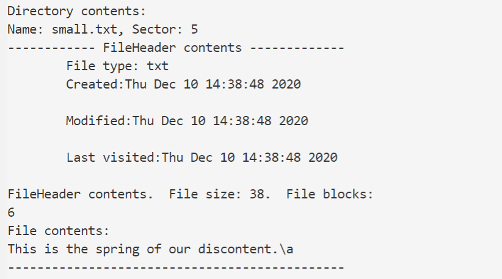
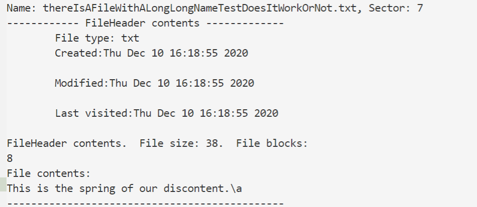
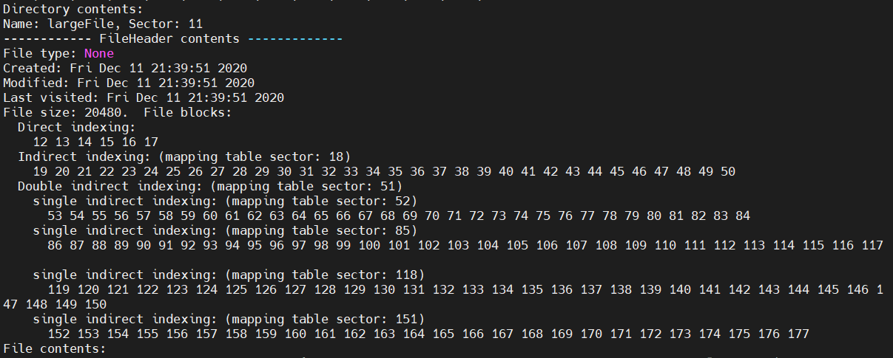
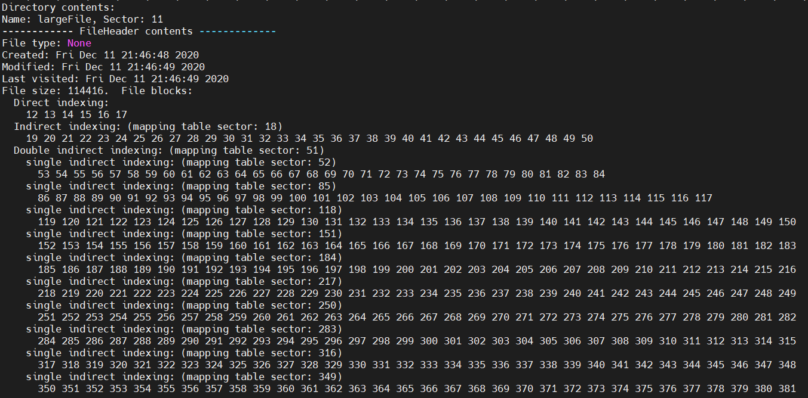
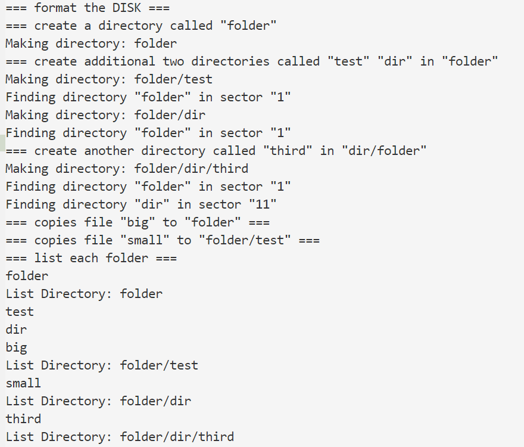
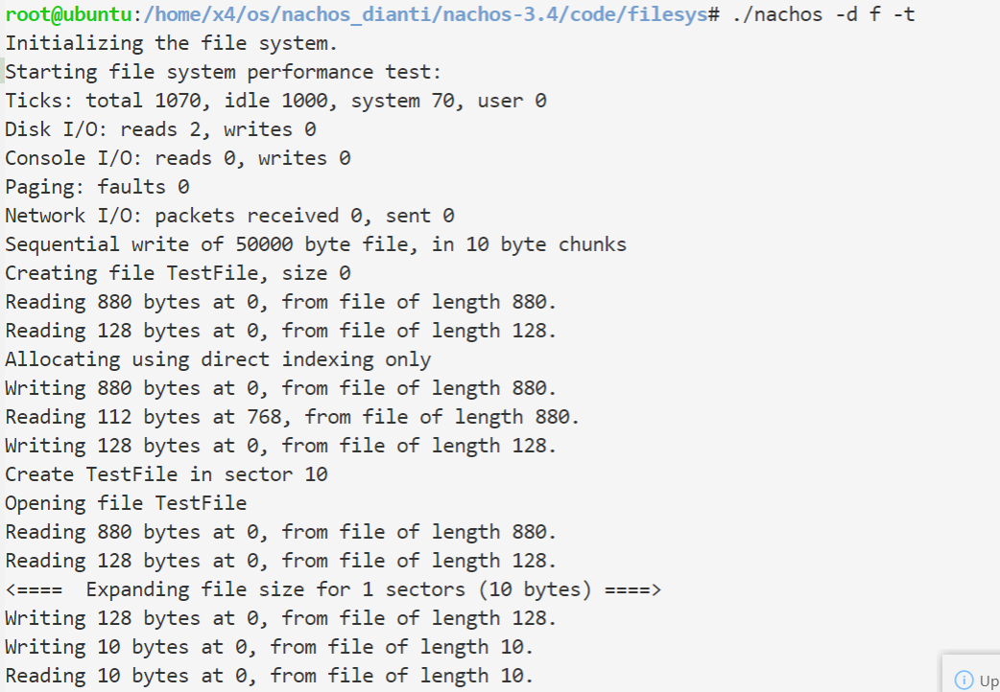
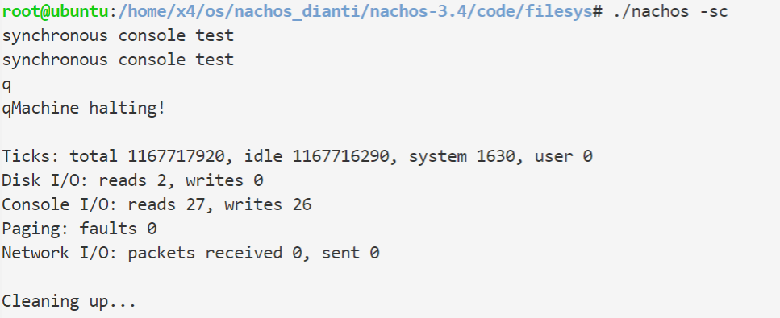
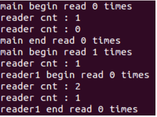
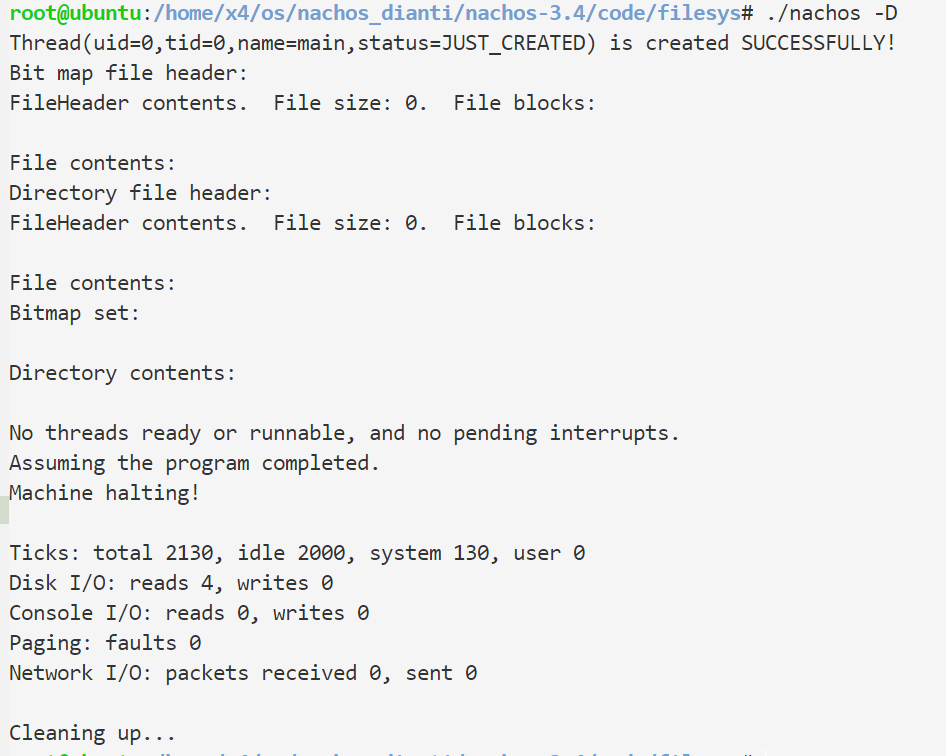
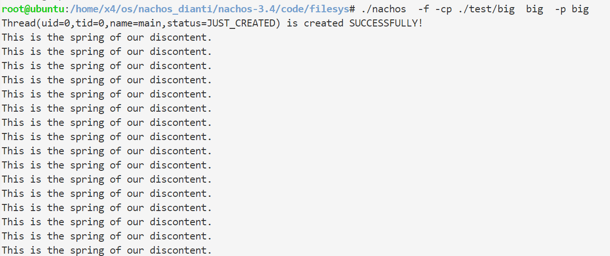

# Lab5 文件系统 实习说明

本实习希望通过修改Nachos系统的底层源代码，达到“完善文件系统”的目标。

- [Lab5 文件系统 实习说明](#lab5----------)
    + [一、文件系统的基本操作](#-----------)
      - [Exercise 1 源代码阅读](#exercise-1------)
      - [Exercise 2 扩展文件属性](#exercise-2-------)
        * [增加文件描述信息](#--------)
        * [突破文件名长度限制](#---------)
      - [Exercise 3 扩展文件长度](#exercise-3-------)
      - [Exercise 4 实现多级目录](#exercise-4-------)
        * [基本思路](#----)
        * [测试结果](#----)
      - [Exercise 5 动态调整文件长度](#exercise-5---------)
    + [二、文件访问的同步与互斥](#------------)
      - [Exercise 6 源代码阅读](#exercise-6------)
      - [Exercise 7 实现文件系统的同步互斥访问机制，达到如下效果：](#exercise-7------------------------)
    + [三、Challenges题目（至少选做1个）](#--challenges-------1--)
      - [Challenge 2  实现pipe机制](#challenge-2----pipe--)
  * [问题](#--)
  * [参考文献](#----)
  * [附录](#--)
    + [如何启用文件系统](#--------)


【背景描述】

Nachos文件系统建立在模拟磁盘上，提供了基本的文件操作，如创建、删除、读取、写入等等。文件的逻辑结构与物理位置之间的映射关系由文件系统统一维护，用户只需通过文件名即可对文件进行操作。
然而，相比于实际文件系统，Nachos文件系统还存在很多不足之处：

- 文件长度的限制
Nachos文件系统采用直接索引方式，故文件长度不能超过4KB（更准确的说，是((128 – 2 * 4) / 4) * 128 = 3840 B）。同时，文件的长度必须在创建时予以指定，且不得更改。
- 文件数目的限制
Nachos文件系统只有一级目录，系统中所有的文件都存于根目录下，且数目不能多于10个。
- 粗粒度的同步互斥机制
Nachos文件系统每次只允许一个线程进行访问，不支持多个线程同时访问文件系统。
- 性能优化与容错
Nachos文件系统没有Cache机制，也没有容错机制，即当文件系统正在使用时，如果系统突然中断，文件内容的正确性无法保证。

【实习内容】


[TOC]


### 一、文件系统的基本操作
#### Exercise 1 源代码阅读
阅读Nachos源代码中与文件系统相关的代码，理解Nachos文件系统的工作原理。
code/filesys/filesys.h和code/filesys/filesys.cc
code/filesys/filehdr.h和code/filesys/filehdr.cc
code/filesys/directory.h和code/filesys/directory.cc
code /filesys/openfile.h和code /filesys/openfile.cc
code/userprog/bitmap.h和code/userprog/bitmap.cc  

<pre lang="txt">
<code>
Nachos File System
+-----------------------------------+
|             File User             |
+-----------------------------------+
| FileSystem | OpenFile | Directory |
+------------+----------+-----------+
|            File Header            |
+-----------------------------------+
|             SynchDisk             |
+-----------------------------------+
|                Disk               |
+-----------------------------------+
</code>
</pre>

<pre lang="txt">
<code>
Disk Allocation Structure

+----+----+---------------------+
| 0# | 1# | Normal Storage Area |
+----+----+---------------------+
  |     |
  |    1#: Root directory's i-node
  |
 0#: System bitmap file's i-node
</code>
</pre>

初始化：
main读取参数，在<code>system.cc</code>中：
```c
void
Initialize(int argc, char **argv)
{
    ...

#ifdef FILESYS_NEEDED
    bool format = FALSE;	// format disk
#endif

    ...

#ifdef FILESYS_NEEDED
	if (!strcmp(*argv, "-f"))
	    format = TRUE;
#endif

#ifdef FILESYS
    synchDisk = new SynchDisk("DISK");
#endif

#ifdef FILESYS_NEEDED
    fileSystem = new FileSystem(format);
#endif

    ...

}
```

#### Exercise 2 扩展文件属性
增加文件描述信息，如“类型”、“创建时间”、“上次访问时间”、“上次修改时间”、“路径”等等。尝试突破文件名长度的限制。

##### 增加文件描述信息
<code>filesys/filehdr.h</code>
当前的文件系统的文件头包含：文件的字节数、数据存放的扇区、每个数据块存放的磁盘扇区号。
<pre lang="txt">
<code>
The visual FileHeader attributes

+-----------------------------------------+
|           FileHeader (i-node)           |
+-----------------------------------------+
|   Disk Part  | numBytes (int)           |
+              +--------------------------+
|   (total     | numSectors (int)         |
+  128 bytes)  +--------------------------+
|              | dataSectors[NumDirect]   | => size = 128 - others;
+--------------+--------------------------+    mapping entries = size/sizeof(int)
</code>
</pre>

为其增加需要的信息，变为以下结构：
<pre lang="txt">
<code>
The visual FileHeader attributes

+-----------------------------------------+
|           FileHeader (i-node)           |
+-----------------------------------------+
|   Disk Part  | numBytes (int)           |
+              +--------------------------+
|   (total     | numSectors (int)         |
+  128 bytes)  +--------------------------+
|              | fileType (string)        |
+              +--------------------------+
|              | createdTime (string)     |
+              +--------------------------+
|              | modifiedTime (string)    |
+              +--------------------------+
|              | lastVisitedTime (string) |
+              +--------------------------+
|              | dataSectors[NumDirect]   | => size = 128 - others;
+--------------+--------------------------+    mapping entries = size/sizeof(int)
| In-core Part | headerSector             |
+--------------+--------------------------+
</code>
</pre>
In-core Part将会存储在内存中，而 Disk Part将会存储在磁盘中，到需要的时候才会读取。

在<code>filesys/filesys.h</code>中定义：
```c
#include <time.h>
// Disk part
#define NumOfIntHeaderInfo 2
#define NumOfTimeHeaderInfo 3
#define LengthOfTimeHeaderStr 26 // 25 + 1 ('/0')
#define MaxExtLength 5           // 4  + 1 ('/0')
#define LengthOfAllString MaxExtLength + NumOfTimeHeaderInfo*LengthOfTimeHeaderStr

#define NumDirect 	((SectorSize - (NumOfIntHeaderInfo*sizeof(int) + LengthOfAllString*sizeof(char))) / sizeof(int))
```

修改后的文件头保存的成员变量：
```c
class FileHeader {
  private:
    // ======================== Disk Part ======================== //
    // == Header Information == //
    int numBytes;   // Number of bytes in the file
    int numSectors; // Number of data sectors in the file

    // Lab5: additional file attributes
    char fileType[MaxExtLength];
    char createdTime[LengthOfTimeHeaderStr];
    char modifiedTime[LengthOfTimeHeaderStr];
    char lastVisitedTime[LengthOfTimeHeaderStr];

    // == Data Sectors == //
    int dataSectors[NumDirect]; // Disk sector numbers for each data
                                // block in the file
    // ======================== In-core Part ======================== //
    // This will be assign value when the file is open!
    int headerSector; // Because when we OpenFile, we need to update the header information
                      // but the sector message is only exist when create the OpenFile object
                      // some how we need to know which sector to write back
}
```
以及一些需要的函数：
```c
class FileHeader {
  public:

    ...

    // Lab5: additional file attributes
    void HeaderCreateInit(char* ext); // Initialize all header message for creation
    // Disk part
    void setFileType(char* ext) { strcmp(ext, "") ? strcpy(fileType, ext) : strcpy(fileType, "None"); }
    void setCreateTime(char* t) { strcpy(createdTime, t); }
    void setModifyTime(char* t) { strcpy(modifiedTime, t); }
    void setVisitTime(char* t) { strcpy(lastVisitedTime, t); }
    // In-core part
    void setHeaderSector(int sector) { headerSector = sector; }
    int getHeaderSector() { return headerSector; }
}
```

HeaderCreateInit函数在文件第一次被创建的时候进行一些赋值：
```c
void
FileHeader::HeaderCreateInit(char* ext)
{
    setFileType(ext);

    char* currentTimeString = getCurrentTime();
    setCreateTime(currentTimeString);
    setModifyTime(currentTimeString);
    setVisitTime(currentTimeString);
}
```

在文件系统初始化的同时初始化位图和目录的文件头：
<code>filesys/filesys.cc:FileSystem(bool Format)</code>
```c

FileSystem::FileSystem(bool format)
{ 
//...
FileHeader *mapHdr = new FileHeader;
mapHdr->HeaderCreateInit("BMap");
FileHeader *dirHdr = new FileHeader;
dirHdr->HeaderCreateInit("DirH");
//...
}
```
创建文件的时候：

<code>filesys/filesys.cc</code>
```c

bool
FileSystem::Create(char *name, int initialSize){
    //...
  hdr->HeaderCreateInit(getFileExtension(name));
  //...
}
```
在Open File的时候设置更新文件头扇区号：
```c
OpenFile::OpenFile(int sector)
{
    hdr = new FileHeader;
    hdr->FetchFrom(sector);
    hdr->setHeaderSector(sector); // Necessary, because we need to update
                                  // FileHeader(i-node) later on.
}

OpenFile::~OpenFile()
{
    hdr->WriteBack(hdr->getHeaderSector()); // Update the header info
    delete hdr;
}
```
读文件的时候更新最近访问时间，写文件的时候更新访问时间和修改时间。

<code>filesys/openfile.cc</code>
```c

int
OpenFile::ReadAt(char *into, int numBytes, int position){    
    hdr->setVisitTime(getCurrentTime());
}

int
OpenFile::WriteAt(char *from, int numBytes, int position)
{
    hdr->setVisitTime(getCurrentTime());
    hdr->setModifyTime(getCurrentTime());
}
```

**测试结果**
以下命令行将做的事：把 filesys/test/small 复制到nachos文件系统中，命名为small.txt，打印出文件内容，最后打印整个文件系统信息。
<pre lang="txt">
<code>
#!/bin/sh
echo "=== copies file \"small\" from UNIX to Nachos (and add extension) ==="
./nachos -Q -cp test/small small.txt
sleep 1 # to observe the modification time change
echo "=== print the content of file \"small\" ==="
./nachos -Q -p small.txt
echo "=== prints the contents of the entire file system ==="
./nachos -Q -D
</code>
</pre>

##### 突破文件名长度限制
文件名长度的限制定义在<code>filesys/directory.h</code>里:
```c
#define FileNameMaxLen 		9	// for simplicity, we assume 
					// file names are <= 9 characters long

class DirectoryEntry {
  public:
    bool inUse;				// Is this directory entry in use?
    int sector;				// Location on disk to find the 
					//   FileHeader for this file 
    char name[FileNameMaxLen + 1];	// Text name for file, with +1 for 
					// the trailing '\0'
};
```

如果参照NumDirect的写法，应该更改为：
```c
#define FileNameMaxLen ((SectorSize - sizeof(bool) - sizeof(int)) / sizeof(char)) - 1
```
但是，“FileHeader”存储在一个扇区中，但是“DirectoryEntry”仅是Directory表的一部分，DirectoryEntry大小将影响的最大数量tableSize。
 <code>/filesys/filesys.cc</code>
```c
#define NumDirEntries 		10
#define DirectoryFileSize 	(sizeof(DirectoryEntry) * NumDirEntries)
```

所以，正确的写法是：
```c
// Lab5: Remove the limitation of the previous file name length
#define NumDirEntries 10 // originally defined in fileysys/filesys.cc
#define FileNameMaxLen (((SectorSize - (sizeof(bool) + sizeof(int)) * NumDirEntries) / sizeof(char)) - 1)
```

> 其实很好理解：目录保存着文件名和文件头，且占用一个扇区，因此所有条目的文件名的长度加上文件头的长度不能超过一个扇区大小。
也就是说：**扇区大小=（文件名长度+文件头长度）\* 最大条目数**，即能推出文件名长度最大值。

**测试结果**




#### Exercise 3 扩展文件长度
改直接索引为间接索引，以突破文件长度不能超过4KB的限制。


原本的文件最大长度限制为：3840B（30 * 128B），在经历前面的实验之后，已经变为：1152B（9 * 128B）。文件头的存储只有一个扇区大小。
现在我使用文件块的倒数第二个块为一级索引，倒数第一个为二级索引。文件的最大大小将变为：7 * 128 + 32 * 128 + 32 * 32 * 128 = 136064 B

修改直接索引数目，注意dataSector的大小为NumDirect + 2。
```c
#define NumDirect 	((SectorSize  - 2 - (NumOfIntHeaderInfo*sizeof(int) + LengthOfAllString*sizeof(char))) / sizeof(int))

#define IndirectSectorIdx  NumDirect 
#define DoubleIndirectSectorIdx  NumDirect + 1
```
接下来，要重写FileHeader的如下函数：
- Allocate
判断文件大小是否能够用直接索引容纳，如果不能再判断是否能用一级索引，还是不能再判断是否能用二级索引，否则出错。
文件头的倒数第二块存储一级索引的磁盘号，每个索引块大小为32个。
- Deallocate
- ByteToSector
这个函数在OpenFile::ReadAt以及WriteAt中通过 synchDisk->ReadSector 和  synchDisk->WriteSector调用，读写文件内偏移所在的扇区。在实现了二级索引之后要对其做相应的修改。
- Print

**测试结果**
通过以下命令进行测试：
<pre lang="txt">
<code>
#!/bin/sh
# use -Q to disable verbose machine messages
echo "=== format the DISK ==="
./nachos -Q -f
echo "Generate the large file for single indirect indexing"
dd if=/dev/zero of=largeFile count=3 bs=1024 # 3KB
echo "=== copies file \"largeFile(3K)\" from UNIX to Nachos ==="
./nachos -Q -cp largeFile largeFile
echo "=== prints the contents of the entire file system ==="
./nachos -Q -D
echo "=== remove the file \"largeFile\" from Nachos ==="
./nachos -Q -r largeFile
echo "=== prints the contents of the entire file system again ==="
./nachos -Q -D

# use -Q to disable verbose machine messages
echo "=== format the DISK ==="
./nachos -Q -f
echo "Generate the large file for double indirect indexing"
dd if=/dev/urandom of=largeFile count=20 bs=1024 # 20KB
echo "=== copies file \"largeFile\" from UNIX to Nachos ==="
./nachos -Q -cp largeFile largeFile
echo "=== prints the contents of the entire file system ==="
./nachos -Q -D
echo "=== remove the file \"largeFile\" from Nachos ==="
./nachos -Q -r largeFile
echo "=== prints the contents of the entire file system again ==="
./nachos -Q -D

# use -Q to disable verbose machine messages
echo "=== format the DISK ==="
./nachos -Q -f
echo "Using 100,000 Decimal Digits of PI as large file"
cp ./test/PI.100.000.TXT largeFile # 112KB
echo "=== copies file \"largeFile\" from UNIX to Nachos ==="
./nachos -Q -cp largeFile largeFile
echo "=== prints the contents of the entire file system ==="
./nachos -Q -D
echo "=== remove the file \"largeFile\" from Nachos ==="
./nachos -Q -r largeFile
echo "=== prints the contents of the entire file system again ==="
./nachos -Q -D
</code>
</pre>

- 大小为3k的文件/dev/zero
<pre lang="txt">
<code>
dd if=/dev/zero of=largeFile count=3 bs=1024 # 3KB
./nachos -Q -cp largeFile largeFile
./nachos -Q -D
</code>
</pre>


- 大小为20k的文件/dev/urandom
<pre lang="txt">
<code>
dd if=/dev/urandom of=largeFile count=20 bs=1024 # 20KB
./nachos -Q -cp largeFile largeFile
./nachos -Q -D
</code>
</pre>




- 大小为112KB的文件[PI's 100000 digits](https://thestarman.pcministry.com/math/pi/PI.100.000.TXT)


#### Exercise 4 实现多级目录
##### 基本思路
1. 对文件和目录做区分
2. 增加目录结构体，包括路径、目录深度、每层目录所在扇区
3. 修改Create、Remove、Open函数

同时，增加-mkdir参数用于创建目录，-rd用于删除，-ld用于列出目录，并在main函数中做出对应修改。

- 目录结构体
定义在<code>filehdr.h</code>中
  ```c
  typedef struct {
    char* dirArray[MAX_DIR_DEPTH];
    int dirDepth; // if root dir, dir depth = 0
    char* base;
  } FilePath;
  ```

- 几个工具函数
  - 切分路径和文件名的函数
  这里直接使用<code>libgen.h</code>中的接口，使用示例如下：
  ```c
  #include <libgen.h>
  #include <string.h>
  char* local_file = "/foo/bar/baz.txt";
  char* ts1 = strdup(local_file);
  char* ts2 = strdup(local_file);
  char* dir = dirname(ts1);
  char* filename = basename(ts2);
  // use dir and filename now
  // dir: "/foo/bar"
  // filename: "baz.txt"
  ```
  - pathParser将根据字符串构造FilePath实体
  - FileSystem::FindDirSector返回文件所在目录的扇区，主要是通过以下的循环逐层寻找：
    ```c
    for(int i = 0; i < filepath.dirDepth; i++) {
            DEBUG('D', COLORED(BLUE, "Finding directory \"%s\" in sector \"%d\"\n"), filepath.dirArray[i], sector);
            dirFile = new OpenFile(sector);
            dirTemp = new Directory(NumDirEntries);
            dirTemp->FetchFrom(dirFile);
            sector = dirTemp->Find(filepath.dirArray[i]);
            if (sector == -1)
                break; // Not found
        }
    ```
  - FileSystem::FindDir 返回目录实体

- **Create方法**
  - 判断是否为目录。
  若创建文件，与原流程相同
  - 若为目录
     1. 在当前目录下新建一个子目录
     2. 打开它的文件头
     3. 把文件头写回子目录
     4. 把当前打开的目录写回
     ```c
     if(isDir) {
         Directory* dir = new Directory(NumDirEntries);
        OpenFile* subDirFile = new OpenFile(sector);
        dir->WriteBack(subDirFile);
        delete dir;
        delete subDirFile;
      }
        directory->WriteBack(dirFile);
        delete dirFile;
    ```
- **Open方法**
原来的流程直接通过FetchFrom填充directory对象，现在要先遍历到子目录，再填充。
```c
#ifndef MULTI_LEVEL_DIR
    directory = new Directory(NumDirEntries);
    directory->FetchFrom(directoryFile);
#else
    directory = (Directory*)FindDir(name);
    FilePath filepath = pathParser(name);
    if (filepath.dirDepth > 0) {
        name = filepath.base;
    }
#endif
```

- **Remove方法**
-r指令只能删除文件，不能删除目录，-rd指令删除目录。


##### 测试结果
通过以下命令创建如下的目录结构：
- /
  - folder/ (directory)
    - test/ (directory)
      - small (file)
    - dir/ (directory)
      - third/ (directory)
    - big (file)
<pre lang = "txt">
<code>
#!/bin/sh

# use -Q to disable verbose machine messages
echo "=== format the DISK ==="
./nachos -Q -f
echo "=== create a directory called \"folder\""
./nachos -Q -d D -mkdir folder
echo "=== create additional two directories called \"test\" \"dir\" in \"folder\""
./nachos -Q -d D -mkdir folder/test
./nachos -Q -d D -mkdir folder/dir
echo "=== create another directory called \"third\" in \"dir/folder\""
./nachos -Q -d D -mkdir folder/dir/third

echo "=== copies file \"big\" to \"folder\" ==="
./nachos -Q -cp test/big folder/big
echo "=== copies file \"small\" to \"folder/test\" ==="
./nachos -Q -cp test/small folder/test/small

echo "=== list each folder ==="
./nachos -Q -l
./nachos -Q -ld folder
./nachos -Q -ld folder/test
./nachos -Q -ld folder/dir
./nachos -Q -ld folder/dir/third
echo "=== prints the contents of the entire file system ==="
./nachos -Q -D

echo "=== test delete folder with \"-r\" which should fail"
./nachos -Q -d D -r folder
echo "=== remove the file \"folder/test/small\" using recursive delete ==="
./nachos -Q -rd folder/test/small
echo "=== remove the directory \"test\" (empty directory) ==="
./nachos -Q -rd folder/test
echo "=== remove the directory \"folder\" recursively (non-empty directory) ==="
./nachos -Q -rd folder

echo "=== list each folder again ==="
./nachos -Q -l
./nachos -Q -ld folder
./nachos -Q -ld folder/test
./nachos -Q -ld folder/dir
./nachos -Q -ld folder/dir/third
# echo "=== prints the contents of the entire file system again ==="
# ./nachos -Q -D
</code>
</pre>

结果如下：

删除后：


#### Exercise 5 动态调整文件长度
对文件的创建操作和写入操作进行适当修改，以使其符合实习要求。 

这里关闭多级目录和二级索引进行实现。
- 在文件头中修改文件长度属性和占用扇区数
  - 计算需要的扇区数，若小于已分配的，则不需更多的扇区
  - 若大于，则看磁盘是否有足够的剩余空间够分配
  - 需要的扇区数是否大于索引数
```c

bool
FileHeader::ExpandFileSize(BitMap *freeMap, int additionalBytes)
{
    ASSERT(additionalBytes > 0);
    numBytes += additionalBytes;
    int initSector = numSectors;
    numSectors = divRoundUp(numBytes, SectorSize);
    if (initSector == numSectors) {
        return TRUE; // no need more sector
    }
    int sectorsToExpand = numSectors - initSector;
    if (freeMap->NumClear() < sectorsToExpand) {
        return FALSE; // no more space to allocate
    }
    if (numSectors < NumDirect) { // just like FileHeader::Allocate
        for (int i = initSector; i < numSectors; i++)
            dataSectors[i] = freeMap->Find();
    } else {
        ASSERT_MSG(FALSE, "File size exceeded the maximum representation of the direct map");
    }

    return TRUE;
}

```
- 当写入字节超出文件长度时，重新分配空间
<code>filesys/openfile.cc:WriteAt</code>
```c
    // Lab5: dynamic allocate file size
    if (position + numBytes > fileLength) {
        BitMap *freeMap = new BitMap(NumSectors);
        OpenFile* freeMapFile = new OpenFile(FreeMapSector);
        freeMap->FetchFrom(freeMapFile);
        hdr->ExpandFileSize(freeMap, position + numBytes - fileLength);
        hdr->WriteBack(hdr->getHeaderSector());
        freeMap->WriteBack(freeMapFile);
        delete freeMapFile;
        fileLength = hdr->FileLength();
    }

```
**测试结果**


### 二、文件访问的同步与互斥
#### Exercise 6 源代码阅读
a)	阅读Nachos源代码中与异步磁盘相关的代码，理解Nachos系统中异步访问模拟磁盘的工作原理。
filesys/synchdisk.h和filesys/synchdisk.cc

Nachos的磁盘是异步的，当发出访问磁盘的请求后立刻返回，当从磁盘读写数据结束后发出磁盘中断，说明一次磁盘访问真正结束。
- 同时只能有一个线程访问磁盘
- 当发出磁盘访问请求后，必须等待访问的真正结束

以ReadSector为例：
```c
void
SynchDisk::ReadSector(int sectorNumber, char* data)
{
    lock->Acquire();			// 加锁（一次只允许一个线程访问磁盘）
    disk->ReadRequest(sectorNumber, data);       //对磁盘进行读访问请求
    semaphore->P();			// 等待磁盘中断的到来
    lock->Release();    //解锁（访问结束）
}
```
当线程向磁盘设备发出读访问请求后，等待磁盘中断的到来。一旦磁盘中断来到，中断处理程序执行semaphore->V()操作，ReadSector继续运行。


b)	利用异步访问模拟磁盘的工作原理，在Class Console的基础上，实现Class SynchConsole。

在<code>machine/console.h</code>中新定义如下结构：
```c
class SynchConsole {
  public:
    SynchConsole(char *readFile, char *writeFile); // initialize the hardware console device
    ~SynchConsole();                               // clean up console emulation

// external interface -- Nachos kernel code can call these
    void PutChar(char ch); // Write "ch" to the console display,
                           // and return immediately.  "writeHandler"
                           // is called when the I/O completes.
    char GetChar(); // Poll the console input.  If a char is
                    // available, return it.  Otherwise, return EOF.
                    // "readHandler" is called whenever there is
                    // a char to be gotten

// internal emulation routines -- DO NOT call these.
    void WriteDone(); // internal routines to signal I/O completion
    void ReadAvail();

private:
    Console *console;
    Lock *lock;
    Semaphore *semaphoreReadAvail;
    Semaphore *semaphoreWriteDone;
};
```

仿照syndisk实现。

**测试结果**
在<code>userprog/progtest.cc</code>中增加：
```c
static SynchConsole *synchConsole;

void
SynchConsoleTest (char *in, char *out)
{
    char ch;

    synchConsole = new SynchConsole(in, out);

    for (;;) {
        ch = synchConsole->GetChar();
        synchConsole->PutChar(ch); // echo it!
        if (ch == 'q')
            return; // if q, quit
    }
}
```
增加-sc命令行参数进行调用测试，并用q退出：


#### Exercise 7 实现文件系统的同步互斥访问机制，达到如下效果：
a)	一个文件可以同时被多个线程访问。且每个线程独自打开文件，独自拥有一个当前文件访问位置，彼此间不会互相干扰。
b)	所有对文件系统的操作必须是原子操作和序列化的。例如，当一个线程正在修改一个文件，而另一个线程正在读取该文件的内容时，读线程要么读出修改过的文件，要么读出原来的文件，不存在不可预计的中间状态。
c)	当某一线程欲删除一个文件，而另外一些线程正在访问该文件时，需保证所有线程关闭了这个文件，该文件才被删除。也就是说，只要还有一个线程打开了这个文件，该文件就不能真正地被删除。

a)当前的机制，不同的线程有不同的OpenFile，即独立的seekPosition，不会互相干扰
b)采用读写者模型，一个时刻只允许一个写或多个读。一个文件对应一个信号量，对于写者，需要在写前P，写完后V，对于读者，要维护读者数量。读者数量从0到1时P，从1到0时V。并用锁保护读者数量。
<code>filesys/synchdisk.h</code>
```c
class SynchDisk {
  public:
//...
          //------------------------Lab 4----------------------
          void PlusReader(int sector);
          void MinusReader(int sector);
          void BeginWriter(int sector);
          void EndWriter(int sector);
          //--------------------------------------------------- 

  private:
  //...

      //----------------------Lab 4-------------------------------
      Semaphore *mutex[NumSectors];   // file visit num
      int numReaders[NumSectors];     // reader num
      Lock *readerLock;               //reader num semaphore

      //----------------------------------------------------------
};
```

<code>filesys/openfile.cc</code>
```c

int
OpenFile::Read(char *into, int numBytes)
{
    synchDisk -> PlusReader(hdr->getHeaderSector());

   int result = ReadAt(into, numBytes, seekPosition);

   currentThread->Yield();

   seekPosition += result;

   synchDisk -> MinusReader(hdr->getHeaderSector());
   return result;
}

int
OpenFile::Write(char *into, int numBytes)
{
    synchDisk -> BeginWriter(hdr->getHeaderSector());
   int result = WriteAt(into, numBytes, seekPosition);
   currentThread -> Yield();
   seekPosition += result;
   
    synchDisk -> EndWriter(hdr->getHeaderSector());
   return result;
}

```


c)要统计访问文件的线程数
<code>filesys/synchdisk.h</code>增加numVisitors成员变量，记录线程数量。<code>filesys/openfile.cc</code>的构造函数和析构函数控制文件关闭。<code>filesys/filesys.cc</code>的Remove函数中，如果该文件的线程数不为0，则无法删除。
```c
if(synchDisk->numVisitors[sector]){
    printf("unable to remove the file,there are still visitors\n");
    return false;
}
```

**测试结果**
1. 线程1写文件，线程1、2同时读

2. 线程1写文件，线程2读

3. 线程1读写文件，线程2删除

### 三、Challenges题目（至少选做1个）

#### Challenge 2  实现pipe机制
重定向openfile的输入输出方式，使得前一进程从控制台读入数据并输出至管道，后一进程从管道读入数据并输出至控制台。
**基本思路**
使用管道文件模拟实现。
- 固定文件头在2号扇区
```c
#define PipeSector 2
```
- 在<code>filesys/filesys.cc</code>的构造函数中初始化
```c

    FileHeader *pipeHdr = new FileHeader;
    freeMap->Mark(PipeSector);
	ASSERT(pipeHdr->Allocate(freeMap, PipeFileSize));
    pipeHdr ->WriteBack(PipeSector);
```
- ReadPipe和WritePipe函数管理管道文件的读写
  - 写入时根据数据量修改管道文件长度
  ```c

	void FileSystem::WritePipe(char *data,int length){
        OpenFile *pipe_file = new OpenFile(PipeSector);
        pipe_file -> Write(data,length);
        printf("writing data into the pipe\n");
        pipe_file->Print();
        delete pipe_file;
        FileHeader *fileHdr = new FileHeader;
        fileHdr->FetchFrom(PipeSector);
        fileHdr->numBytes = length;
        fileHdr -> WriteBack(PipeSector);
    }
  ```
  - 读出时根据文件长度获得数据量
  ```c
	int FileSystem::ReadPipe(char * data){
        FileHeader *fileHdr = new FileHeader;
        fileHdr->FetchFrom(PipeSector);
        int length = fileHdr->numBytes;
        fileHdr->WriteBack(PipeSector);
        OpenFile *pipe_file = new OpenFile(PipeSector);
        printf("reading data from the pipe\n");
        delete pipe_file;
        return length;
    }
  ```

  **测试结果**


【实习建议】
1.	数据结构的修改和维护
文件管理的升级基于对原有Nachos数据结构的修改。增加文件的描述信息需对文件头结构进行简单修改。多级目录中可创建目录也可创建文件，应根据实际的文件类型初始化文件头信息。
2.	实现多级目录应当注意
- 目录文件的含义。每个目录对应一个文件，通过此文件可了解其子目录及父目录的信息。
- Nachos的目录文件大小是预先定义的，但实际上，目录文件的大小应根据内容确定，且能改变。
- 实现多级目录后，添加、删除目录项要根据具体的路径，对树的遍历要有深刻的理解。
3.	为了实现文件长度无限，可以采取混合索引的分配方式。

## 问题
删除的时候，只能删除空目录和文件，还没有实现对目录下是否还有子目录或文件的判断，以及递归的强制删除。

## 参考文献
[How To Quickly Generate A Large File On The Command Line (With Linux)](https://skorks.com/2010/03/how-to-quickly-generate-a-large-file-on-the-command-line-with-linux/)
[How to get the directory path and file name from a absolute path in C on Linux](https://www.systutorials.com/how-to-get-the-directory-path-and-file-name-from-a-absolute-path-in-c-on-linux/)

## 附录
### 如何启用文件系统
在/filesys目录下：
make depend
make nachos

在没有格式化磁盘的时候查看整个文件系统：./nachos -D


格式化磁盘并打印调试信息：./nachos -f -d d


格式化磁盘，查看文件系统：./nachos -f -D


复制文件到磁盘并打印文件内容：./nachos -f -cp ./test/big big -p big


列出目录内容：./nachos -l

