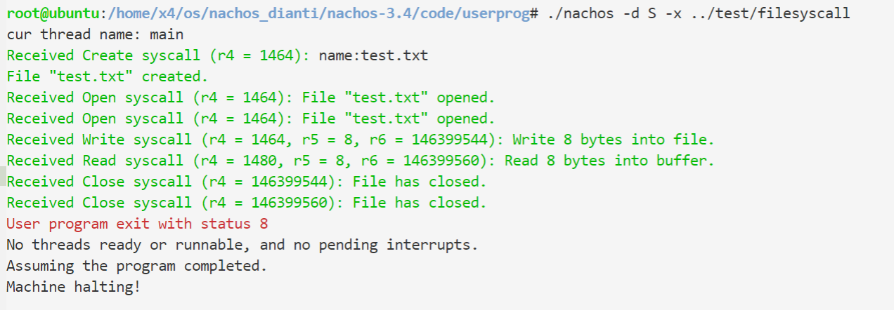

# Lab6 系统调用
- [Lab6 系统调用](#lab6-----)
  * [【实习内容】](#------)
    + [一、理解Nachos系统调用](#----nachos----)
      - [Exercise 1  源代码阅读](#exercise-1-------)
        * [start.s](#starts)
        * [基本流程](#----)
        * [添加一个系统调用](#--------)
    + [二、文件系统相关的系统调用](#-------------)
      - [Exercise 2  系统调用实现](#exercise-2--------)
        * [Create](#create)
        * [Open](#open)
        * [Close](#close)
        * [Read](#read)
        * [Write](#write)
      - [Exercise 3  编写用户程序](#exercise-3--------)
    + [三、执行用户程序相关的系统调用](#---------------)
      - [Exercise 4  系统调用实现](#exercise-4--------)
        * [Exec](#exec)
        * [Join](#join)
        * [Exit](#exit)
        * [Fork](#fork)
        * [Yield](#yield)
      - [Exercise 5  编写用户程序](#exercise-5--------)
        * [Exit](#exit-1)
        * [Fork && Yield](#fork----yield)
        * [Exec && Join](#exec----join)

本实习希望通过修改Nachos系统的底层源代码，达到“实现系统调用”的目标。

## 【实习内容】
### 一、理解Nachos系统调用
#### Exercise 1  源代码阅读
阅读与系统调用相关的源代码，理解系统调用的实现原理。
code/userprog/syscall.h
code/userprog/exception.cc
code/test/start.s

##### start.s
系统调用是常驻内存的，实在用户态下运行的程序和操作系统的界面，用户态程序可以通过系统调用获得操作系统提供的各种服务。
在之前完善虚拟内存的时候已经遇到过异常处理，在Nachos中，系统调用和异常的入口都是ExceptionHandler函数（定义在<code>userprog/exception.cc</code>），仅仅从类型上进行区分，为SyscallException。
同一个入口函数，区分不同的系统调用：在<code>test/starts.s</code>，如Halt系统调用:
```armasm

	.globl Halt
	.ent	Halt
Halt:
	addiu $2,$0,SC_Halt
	syscall
	j	$31
	.end Halt

```
<code>addiu \$2,$0,SC_Halt</code>是在r2寄存器中存放系统调用类别码为SC_Halt。在ExceptionHandler中读取r2寄存器的值，取出系统调用类别码，根据类型进行处理。
系统调用的类别码定义在<code>userprog/syscall.h</code>
```c    
#define SC_Halt		0
#define SC_Exit		1
#define SC_Exec		2
#define SC_Join		3
#define SC_Create	4
#define SC_Open		5
#define SC_Read		6
#define SC_Write	7
#define SC_Close	8
#define SC_Fork		9
#define SC_Yield	10
```
如果系统调用要求参数，MIPS编译规定：
参数|寄存器
-|-
1|r4
2|r5
3|r6
4|r7
如果要求返回值，则存放在r2寄存器中。

Nachos中已经实现Halt系统调用，没实现的有：
- 3种涉及地址空间
  - void Exit(int status)
  用户程序完成，status=0表示正常退出。
  - SpaceId Exec(char *name)
  加载并执行名字是name 的Nachos可执行文件，返回其地址空间的标识符。SpaceId是int类型，标识地址空间。
  - int Join(SpacdeId id)
  等待标志为id的用户线程运行完毕，返回其退出状态。
- 5种涉及文件系统
  - void Create(char *name)
  创建文件名name的Nachos文件
  - OpenFileId Open(char *name)
  打开文件名为name的Nachos文件，返回打开文件标识符
  - void Write(char *buffer,int size,OpenFileId id)
  向标志符是id的文件写入buffer中长度为size字节的数据
  - int Read(char *buffer,int size,OpenFileId id)
  从标识符是id的文件读取长度为size字节的数据存入buffer，返回实际读取的字节数
  - void Close(OpenFileId id)
  关闭标识符是id的文件
- 2种系统调用设计用户级线程，用于支持多线程用户程序
  - void Fork(void(*func)())
  创建和当前线程拥有相同地址空间的线程，运行func指针指向的函数
  - void Yield()
  当前线程让出CPU
##### 基本流程
manchine的Run函数（<code>machine/mipssim.cc</code>）运行用户程序，调用OneInstruction函数完成指令译码和执行，通过interrupt的OneTick函数（<code>machine/interrupt.cc</code>）使得时钟前进。
- OneInstruction函数判断当前的指令是系统调用，转入start.s
```c
void
Machine::OneInstruction(Instruction *instr)
{
	...
	 case OP_SYSCALL:
	RaiseException(SyscallException, 0);
	return; 
	...
}
```
- starts.s通过r2寄存器确定是哪个系统调用，转入exception.cc
- exception.cc的ExceptionHandler函数（<code>userprog/exception.cc</code>）处理对应系统调用的请求，如果有返回值，保存至r2寄存器，结束时更新PC
```c
void
ExceptionHandler(ExceptionType which)
{
    int type = machine->ReadRegister(2);

    if ((which == SyscallException) && (type == SC_Halt)) {
	DEBUG('a', "Shutdown, initiated by user program.\n");
   	interrupt->Halt();
    } else {
	printf("Unexpected user mode exception %d %d\n", which, type);
	ASSERT(FALSE);
    }
}

```
- 返回程序


##### 添加一个系统调用
- syscall.h定义系统调用接口、系统调用号
- test/start.s添加相应汇编代码
- exception.cc添加相应处理


### 二、文件系统相关的系统调用
#### Exercise 2  系统调用实现
类比Halt的实现，完成与文件系统相关的系统调用：Create, Open，Close，Write，Read。Syscall.h文件中有这些系统调用基本说明。


在<code>userprog/syscall.h</code>中定义
```c
/* A unique identifier for an open Nachos file. */
typedef int OpenFileId;	

/* when an address space starts up, it has two open files, representing 
 * keyboard input and display output (in UNIX terms, stdin and stdout).
 * Read and Write can be used directly on these, without first opening
 * the console device.
 */

#define ConsoleInput	0  
#define ConsoleOutput	1  
 
/* Create a Nachos file, with "name" */
void Create(char *name);

/* Open the Nachos file "name", and return an "OpenFileId" that can 
 * be used to read and write to the file.
 */
OpenFileId Open(char *name);

/* Write "size" bytes from "buffer" to the open file. */
void Write(char *buffer, int size, OpenFileId id);

/* Read "size" bytes from the open file into "buffer".  
 * Return the number of bytes actually read -- if the open file isn't
 * long enough, or if it is an I/O device, and there aren't enough 
 * characters to read, return whatever is available (for I/O devices, 
 * you should always wait until you can return at least one character).
 */
int Read(char *buffer, int size, OpenFileId id);

/* Close the file, we're done reading and writing to it. */
void Close(OpenFileId id);
```
文件系统相关的系统调用都需要知道文件名，因此封装一个工具函数从r4寄存器中读取地址，并通过ReadMem函数获得文件名。
```c
// Helper function to get file name using ReadMem for Create and Open syscall
char* getFileNameFromAddress(int address) {
    int position = 0;
    int data;
    char name[FileNameMaxLength + 1];
    do {
        // each time read one byte
        bool success = machine->ReadMem(address + position, 1, &data);
        ASSERT_MSG(success, "Fail to read memory in Create syscall");
        name[position++] = (char)data;

        ASSERT_MSG(position <= FileNameMaxLength, "Filename length too long")
    } while(data != '\0');
    name[position] = '\0';
    return name;
}

```
##### Create
- 获取文件名
- 调用文件系统的Create函数
```c
 if (type == SC_Create) { // void Create(char *name)
        int address = machine->ReadRegister(4); // memory starting position
        char* name = getFileNameFromAddress(address);
        bool success = fileSystem->Create(name, 0); // initial file length set 0
    } 
```

##### Open
同Create 流程，返回值写入r2寄存器
```c
if (type == SC_Open) { // OpenFileId Open(char *name);
        int address = machine->ReadRegister(4); // memory starting position
        char* name = getFileNameFromAddress(address);
        OpenFile *openFile = fileSystem->Open(name);
        machine->WriteRegister(2, (OpenFileId)openFile); // return result
    } 
```
##### Close
```c
 if (type == SC_Close) { // void Close(OpenFileId id);
        OpenFileId id = machine->ReadRegister(4); // OpenFile object id
        OpenFile* openFile = (OpenFile*)id; // transfer id back to OpenFile
        delete openFile; // release the file
    }
```
##### Read
- r4获得缓冲区指针，r5获得数据长度，r6获得打开文件数据结构
- 调用文件系统的Read函数读取
- 通过WriteMem函数将文件内容写入缓冲区
- 返回值写入r2
```c
if (type == SC_Read) { // int Read(char *buffer, int size, OpenFileId id);
        int address = machine->ReadRegister(4); // memory starting position
        int size = machine->ReadRegister(5); // read "size" bytes
        OpenFileId id = machine->ReadRegister(6); // OpenFile object id
        OpenFile* openFile = (OpenFile*)id; // transfer id back to OpenFile
        char* buffer = new char[size];
        int numBytes = openFile->Read(buffer, size);
        for (int i = 0; i < numBytes; i++) { // each time write one byte
            bool success = machine->WriteMem(address + i, 1, (int)buffer[i]);
            if (!success) { // not sure if this is necessary
                i--;
            }
        }
        machine->WriteRegister(2, numBytes); // Return the number of bytes actually read
    }
```
##### Write

- r4获得缓冲区指针，r5获得数据长度，r6获得打开文件数据结构
- 通过ReadMem函数获得缓冲区数据
- 调用文件系统的Write函数写入文件 

```c
 if (type == SC_Write) { // void Write(char *buffer, int size, OpenFileId id);
        int address = machine->ReadRegister(4); // memory starting position
        int size = machine->ReadRegister(5); // read "size" bytes
        OpenFileId id = machine->ReadRegister(6); // OpenFile object id
        char* buffer = new char[size];
        for (int i = 0; i < size; i++) { // each time write one byte
            bool success = machine->ReadMem(address + i, 1, (int*)&buffer[i]);
            if (!success) { // not sure if this is necessary
                i--;
            }
        }
        OpenFile* openFile = (OpenFile*)id; // transfer id back to OpenFile
        int numBytes = openFile->Write(buffer, size);
        machine->WriteRegister(2, numBytes); // Return the number of bytes actually write
    }
```

#### Exercise 3  编写用户程序
编写并运行用户程序，调用练习2中所写系统调用，测试其正确性。

**基本步骤**
- 创建并打开文件“test.txt”
- 写入字符串
- 读取文件内容
- 关闭文件
- 退出程序
```c
/* filesyscall.c
 *	Simple program to test file system syscall (Lab 6)
 */

#include "syscall.h"

#define BUFFER_SIZE 11

int main() {
    char data[9]; // as file name and content
    char buffer[9];
    OpenFileId fid_write;
    OpenFileId fid_read;
    int numBytes;

    data[0] = 't';
    data[1] = 'e';
    data[2] = 's';
    data[3] = 't';
    data[4] = '.';
    data[5] = 't';
    data[6] = 'x';
    data[7] = 't';
    data[8] = '\0';

    Create(data);

    fid_write = Open(data);
    fid_read = Open(data);

    Write(data, 8, fid_write);

    numBytes = Read(buffer, 8, fid_read);

    Close(fid_write);
    Close(fid_read);

    Exit(numBytes);
}
```
**添加用户程序**
- 修改test/MakeFile
```c
all: halt shell matmult sort filesyscall
filesyscall.o:filesyscall.c
	$(CC) $(CFLAGS) -c filesyscall.c
filesyscall:filesyscall.o start.o
	$(LD) $(LDFLAGS) start.o filesyscall.o -o filesyscall.coff
	../bin/coff2noff filesyscall.coff filesyscall

```
**测试结果**


### 三、执行用户程序相关的系统调用
#### Exercise 4  系统调用实现
实现如下系统调用：Exec，Fork，Yield，Join，Exit。Syscall.h文件中有这些系统调用基本说明。

接口：
```c

/* Address space control operations: Exit, Exec, and Join */

/* This user program is done (status = 0 means exited normally). */
void Exit(int status);	

/* A unique identifier for an executing user program (address space) */
typedef int SpaceId;	
 
/* Run the executable, stored in the Nachos file "name", and return the 
 * address space identifier
 */
SpaceId Exec(char *name);
 
/* Only return once the the user program "id" has finished.  
 * Return the exit status.
 */
int Join(SpaceId id); 	
 
 
/* User-level thread operations: Fork and Yield.  To allow multiple
 * threads to run within a user program. 
 */

/* Fork a thread to run a procedure ("func") in the *same* address space 
 * as the current thread.
 */
void Fork(void (*func)());

/* Yield the CPU to another runnable thread, whether in this address space 
 * or not. 
 */
void Yield();	
```
##### Exec
- 从r4读取文件名指针
- 创建线程执行用户程序
仿照StartProcess程序实现
  - 通过ReadMem获得文件名
  - 通过Open打开文件
  - AddrSpace初始化地址空间
  - InitRegisters初始化寄存器
  - RestoreState装载页表
  - Run运行用户程序

- 将线程ID写入r2
- 更新PC
```c
void exec(int address){
 char name[FileNameMaxLength + 1];
getFileNameFromAddress(address,name); 
    OpenFile *executable = fileSystem->Open(name);
    AddrSpace *space;
    if (executable == NULL) {
    DEBUG('S', COLORED(FAIL, "Unable to open file %s\n", filename);
	return;
    }
    space = new AddrSpace(executable);    
    currentThread->space = space;
    DEBUG('S', COLORED(GREEN, "cur thread name: %s \n",currentThread->getName()));

    delete executable;			// close file
    currentThread->space->InitRegisters();		
    currentThread->space->RestoreState();
     machine->Run();			// jump to the user progam
    ASSERT(FALSE);
}

if (type == SC_Exec) {
        int address = machine->ReadRegister(4); // memory starting position 
        DEBUG('S', COLORED(GREEN, "Received Exec syscall (r4 = %d): "), address);
        Thread * userThread = new Thread("userThread");
        userThread->Fork(exec(address));
        machine->WriteRegister(2,userThread->getThreadId());
        IncrementPCRegs();
    }
```

##### Join
- 读取r4获得线程ID
- 如果在tFlag标志为true，则切换至特定线程(tFlag为之前记录所有线程ID是否分配的数组)
```c
if (type == SC_Join) {
        int threadId = machine->ReadRegister(4); // memory starting position 
        DEBUG('S', COLORED(GREEN, "Received Join syscall (r4 = %d): "), threadId);
        while(tFlag[threadId]){
            currentThread->Yield();
        }
        IncrementPCRegs();
    }
}
```

##### Exit
在之前的实验中已经实现过。
- 读取r4获得退出状态
- 回收线程资源
- 结束当前线程
```c
 if (type == SC_Exit) {

        PrintTLBStatus(); // TLB debug usage

        int status = machine->ReadRegister(4); // r4: first arguments to functions

       // currentThread->setExitStatus(status);
        if (status == 0) {
            DEBUG('S', COLORED(GREEN, "User program exit normally. (status 0)\n"));
        } else {
            DEBUG('S', COLORED(FAIL, "User program exit with status %d\n"), status);
        }

        // TODO: release children

#ifdef USER_PROGRAM
        if (currentThread->space != NULL) {
#if USE_BITMAP || INVERTED_PAGETABLE
            machine->freeMem();
#endif
            delete currentThread->space;
            currentThread->space = NULL;
        }
#endif // USER_PROGRAM
        // TODO: if it has parent, then set this to zombie and signal
        machine->clear();
        IncrementPCRegs();
        currentThread->Finish();
    }
```

##### Fork
Nachos的Fork要求和当前线程拥有同样的space
**开始时刻，父子进程的寄存器除了PC其他都相同，并使用同样的页表，共享machine栈空间（因此子进程不必重设栈空间）**
- 读取r4获得PC值
- 复制当前线程地址空间
  - 拷贝页表和打开文件表
  - machine的PC值修改为r4中读取的，NextPC加4
- 建立线程执行fork
  - 设置当前线程地址空间
  - InitRegisters初始化寄存器
  - RestoreState装载页表
  - 设置PC
  - Run运行用户线程
给线程增加属性fileName：打开文件名

```c
class Info{
    public:
    AddrSpace *space;
    int pc;
};
void fork(int address){
    Info * info = (Info *)address;
    AddrSpace *space = info->space;
    currentThread->space = space;
    int curPC = info->pc;
    space->InitRegisters();		
    space->RestoreState();
    machine->WriteRegister(PCReg,curPC);
    machine->WriteRegister(NextPCReg,curPC+4);
    machine->Run();
}

     if (type == SC_Fork) {
         
        int func_pc = machine->ReadRegister(4); // memory starting position 
        DEBUG('S', COLORED(GREEN, "Received Fork syscall (r4 = %d): "), func_pc);
        OpenFile * executable = fileSystem->Open(currentThread->fileName);
        AddrSpace * space = new AddrSpace(executable);
        space->AddrSpaceCpy(currentThread->space);
        Info * info = new Info;
        info->space = space;
        info->pc = func_pc;
        Thread *forkThread = new Thread("fork thread");
        forkThread->Fork(fork,int(info));
        
        IncrementPCRegs();

     }
```
##### Yield
- 更新PC
先更新，否则死循环
- 调用线程Yield函数
```c
if (type == SC_Yield) {
        
        IncrementPCRegs();
        currentThread->Yield();
    }
```


#### Exercise 5  编写用户程序
编写并运行用户程序，调用练习4中所写系统调用，测试其正确性。


##### Exit
```c
/* exit.c
 *	Simple program to test multi-thread user program (Lab 4)
 */

#include "syscall.h"

int
main()
{
    int i;
    for (i = 0; i < 100; i++) {
        // do nothing
    }
    Exit(87);
}
```

##### Fork && Yield
```c
/* forkyield.c
 *	Simple program to test the thread syscall (Lab 6)
 *  This is used to test the user-level thread operations
 *  This example will create two thread and each of them
 *  will write something in the file.
 */

#include "syscall.h"

char file[9];

void ThreadA() {
    char ch = 'a';
    int i;
    OpenFileId fd;

    fd = Open(file);
    for(i = 0; i < 2; i ++) {
        Write(&ch, 1, fd);
        Yield();
    }
}

void ThreadB() {
    char ch = 'b';
    int i;
    OpenFileId fd;

    fd = Open(file);
    for(i = 0; i < 1; i ++) {
        Write(&ch, 1, fd);
        Yield();
    }
}

int main() {
    file[0] = 't';
    file[1] = 'e';
    file[2] = 's';
    file[3] = 't';
    file[4] = '.';
    file[5] = 't';
    file[6] = 'x';
    file[7] = 't';
    file[8] = '\0';

    Create(file);

    Fork(ThreadA);
    Fork(ThreadB);
}
```


##### Exec && Join
```c
/* execjoin.c
 *	Simple program to test the thread syscall (Lab 6) using the
 *  previous made "exit" program.
 *  This is used to test the address space control operations
 *  This will create executable Exec child with it and the parent will Join
 *  the thread and then Exit with the result
 */

#include "syscall.h"

int main() {
    char executable[5];
    int exitCode;
    SpaceId sp;

    executable[0] = 'e';
    executable[1] = 'x';
    executable[2] = 'i';
    executable[3] = 't';
    executable[4] = '\0';

    sp = Exec(executable);

    exitCode = Join(sp);
    Exit(exitCode);
}
```

这里我关闭了文件系统的多级目录进行测试，所以要把目标文件复制到当前目录下，才能正确执行。

