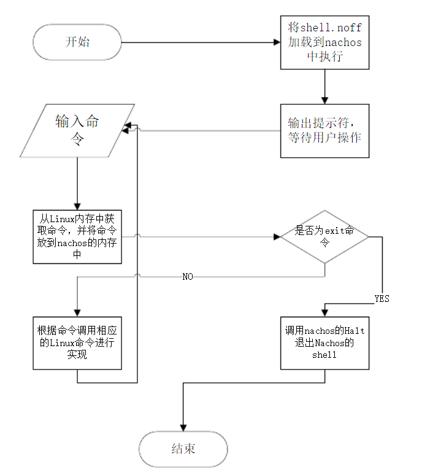
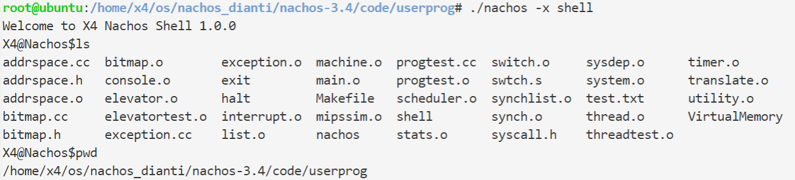
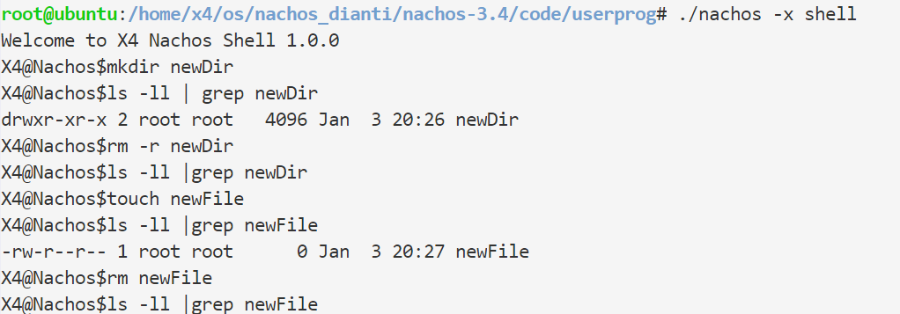
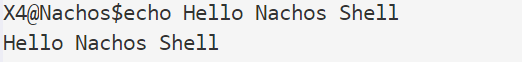
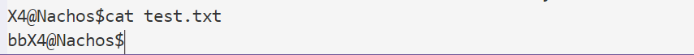

# 操作系统实习
Lab7 shell实现 实习说明

【实习内容】
	设计实现一个用户程序shell，通过./nachos -x shell进入用户交互界面中。在该界面中可以查询支持的功能、可以创建删除文件或目录、可以执行另一个用户程序并输出运行结果，类似Linux上跑的bash。
	你实现的越完善，碰到的问题越多，学到的也会越多。
	本实验所修改的代码包括内核和用户程序两部分。


**基本流程**

<code>test/shell.c</code>
```c

int
main()
{
    SpaceId newProc;
    OpenFileId input = ConsoleInput;
    OpenFileId output = ConsoleOutput;
    char prompt[2], ch, buffer[60];
    int i;

    prompt[0] = '-';
    prompt[1] = '-';

    while( 1 )
    {
	Write(prompt, 2, output);

	i = 0;
	
	do {
	
	    Read(&buffer[i], 1, input); 

	} while( buffer[i++] != '\n' );

	buffer[--i] = '\0';

	if( i > 0 ) {
		newProc = Exec(buffer);
		Join(newProc);
	}
    }
}
```

shell.c中通过循环等待用户输入，用Write调用显示用户命令，Read调用获取命令，并用Exec和Join执行。
```c

    while( 1 )
    {
	Write(prompt, 2, output);

	i = 0;
	
	do {
	
	    Read(&buffer[i], 1, input); 

	} while( buffer[i++] != '\n' );

	buffer[--i] = '\0';

	if( i > 0 ) {
		newProc = Exec(buffer); 
		Join(newProc);
	}
    }
```

在之前实现的Write和Read系统调用之上，要加入判断是否为命令行输入：
```c
 else if (type == SC_Read) { 
        
        int address = machine->ReadRegister(4); 
        int size = machine->ReadRegister(5); 
        OpenFileId id = machine->ReadRegister(6);
        OpenFile* openFile = (OpenFile*)id; 
        char* buffer = new char[size];

        if (id == ConsoleInput)
            for (int i = 0; i < size; ++i)
                buffer[i] = getchar();
        ...
    }
     else if (type == SC_Write) { 
        
        ...
        if (id == ConsoleOutput)
            for (int i = 0; i < size; ++i)
                putchar(buffer[i]);
        ...
    }
```

接下来，判断用户输入是否为空，不为空则陷入内核，执行命令，因此需要增加一个系统调用。在之前的实验中，增加系统调用需要：
- syscall.h定义系统调用接口、系统调用号
<code>userprog/syscall.h</code>
```c
#define SC_Shell    11
...
//Lab 6 shell
void Shell(char *cmd);
```
- test/start.s添加相应汇编代码
<code>test/start.s</code>

```asm
    .globl Shell
    .ent	Shell
Shell:
    addiu $2,$0,SC_Shell
    syscall
    j	$31
    .end Shell
```

- exception.cc添加相应处理
```c

         else if (type == SC_Shell)//run Linux command
        {
            int addr = machine->ReadRegister(4);
            char name[60];
             getFileNameFromAddress(addr,name);
            system(name);
            IncrementPCRegs();
        }
 ```
- 修改shell.c
```c

int
main()
{
    SpaceId newProc;
    OpenFileId input = ConsoleInput;
    OpenFileId output = ConsoleOutput;
    char buffer[60];
    int i;
    Shell("echo  'Welcome to X4 Nachos Shell 1.0.0'");
    while( 1 )
    {
    
    Shell("echo -n 'X4@Nachos$'");
	i = 0;
	
	do {
	    Read(&buffer[i], 1, input); 

	} while( buffer[i++] != '\n' );
	buffer[--i] = '\0';
    if (buffer[0] == 'q' && buffer[1] == '\0')
            Exit(0);
	if( i > 0 ) {
        Shell(buffer);
	}
    }
}
```

**测试结果**

实现命令ls、pwd、mkdir、touch、rm、echo、cat
|  命令   |     功能     | 
| :-----: | :----------: | 
|  *ls*   | 列出当前目录 |   
|  *pwd*  | 打印当前目录 |
| *mkdir* |   创建目录   | 
| *touch* |   创建文件   |        
|  *rm*   |   删除文件   |   
| *echo*  |  打印字符串  | 
|  *cat*  | 打印文件内容 |





|  命令   |     功能     |                       实现                       |
| :-----: | :----------: | :----------------------------------------------: |
|  *ls*   | 列出当前目录 |     打开*cwd*指向的目录，遍历其中元素并打印      |
|  *pwd*  | 打印当前目录 |             打印进程中的*cwd*变量。              |
|  *cd*   |   切换目录   |  调用*chdir*函数切换到目标目录，并维护*cwd*变量  |
| *mkdir* |   创建目录   |         调用*create*创建类型为目录的对象         |
| *touch* |   创建文件   |         调用*create*创建类型为文件的对象         |
|  *rm*   |   删除文件   |                 调用*remove*函数                 |
| *rmdir* |   删除目录   |                  调用*rm* -*rf*                  |
| *exit*  |     退出     |         调用*lab5*中实现的*Exit*系统调用         |
| *echo*  |  打印字符串  |                 调用*printf*函数                 |
|  *cat*  | 打印文件内容 | 和*echo*类似，额外需要从文件中读入*buffer*的操作 |

