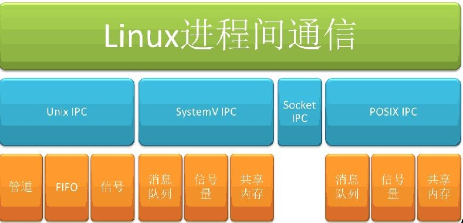
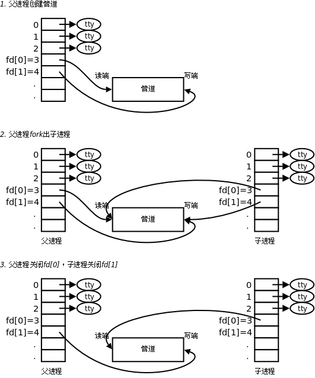
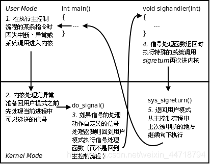
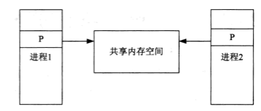
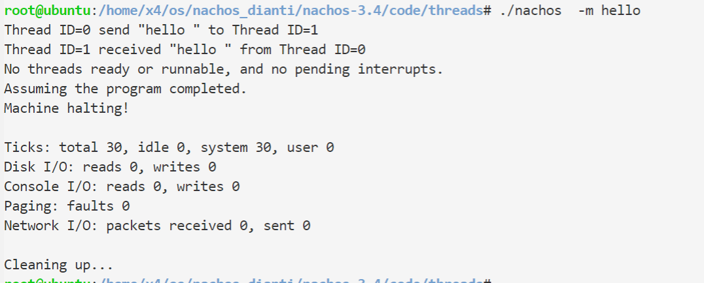

# 操作系统实习
## Lab8 通信机制 实习说明

本实习希望通过修改Nachos系统平台的底层源代码，达到“实现通信机制”的目标。

【实习内容】
### Exercise 1  调研Linux中进程通信机制的实现

#### 管道
 
管道分为有名管道和无名管道。
无名管道是一种半双工的通信方式，数据只能单向流动，而且只能在具有亲缘关系的进程间使用。进程的亲缘关系一般指的是父子关系。
无名管道一般用于两个不同进程之间的通信。当一个进程创建了一个管道,并调用fork创建自己的一个子进程后,父进程关闭读管道端,子进程关闭写管道端,这样提供了两个进程之间数据流动的一种方式。
有名管道也是一种半双工的通信方式,但是它允许无亲缘关系进程间的通信。

#### 信号量
信号量是一个计数器,可以用来控制多个线程对共享资源的访问。它不是用于交换大批数据,而用于多线程之间的同步。它常作为一种锁机制,防止某进程在访问资源时其它进程也访问该资源。因此,主要作为进程间以及同一个进程内不同线程之间的同步手段。
可以分为：
- System V信号量，在内核中维护，可用于进程或线程间的同步，常用于进程的同步。 
- Posix有名信号量，一种来源于POSIX技术规范的实时扩展方案（POSIX Realtime Extension）,可用于进程或线程间的同步，常用于线程。
- Posix基于内存的信号量，存放在共享内存区中，可用于进程或线程间的同步。
#### 信号
信号是一种比较复杂的通信方式,用于通知接收进程某个事件已经发生。
信号是在软件层次上对中断机制的一种模拟，在原理上，一个进程收到一个信号与处理器收到一个中断请求可以说是一样的。信号是异步的，一个进程不必通过任何操作来等待信号的到达，事实上，进程也不知道信号到底什么时候到达。
信号是进程间通信机制中唯一的异步通信机制，可以看作是异步通知，通知接收信号的进程有哪些事情发生了。信号机制经过POSIX实时扩展后，功能更加强大，除了基本通知功能外，还可以传递附加信息。

 
#### 消息队列
消息队列是消息的链表,存放在内核中并由消息队列标识符标识。
消息队列克服了信号传递信息少,管道只能承载无格式字节流以及缓冲区大小受限等特点。
消息队列是UNIX下不同进程之间可实现共享资源的一种机制,UNIX允许不同进程将格式化的数据流以消息队列形式发送给任意进程。对消息队列具有操作权限的进程都可以使用msget完成对消息队列的操作控制。通过使用消息类型,进程可以按任何顺序读信息,或为消息安排优先级顺序。
 
struct ipc_ids msg_ids是内核中记录消息队列的全局数据结构；struct msg_queue是每个消息队列的队列头。
#### 共享内存
 
共享内存就是映射一段能被其他进程所访问的内存,这段共享内存由一个进程创建,但多个进程都可以访问。共享内存是最快的IPC(进程间通信)方式,它是针对其它进程间通信方式运行效率低而专门设计的。它往往与其他通信机制,如信号量,配合使用,来实现进程间的同步与通信。
#### 套接字
socket，即套接字是一种通信机制，凭借这种机制，客户/服务器（即要进行通信的进程）系统的开发工作既可以在本地单机上进行，也可以跨网络进行。也就是说它可以让不在同一台计算机但通过网络连接计算机上的进程进行通信。也因为这样，套接字明确地将客户端和服务器区分开来。
套接字的特性由3个属性确定，它们分别是：域、类型和协议。
可用于不同及其间的进程通信

### Exercise 2  为Nachos设计并实现一种线程/进程间通信机制
我选择实现消息队列。
**基本思路**
设置全局数组，通过其收发消息。

<code>threads/thread.h</code>
```c
#define MAX_CONTENT 20
class Message{
  public:
  int source;          //send thread id
  int cnt;            //length of message (include '\0')
  bool valid;         //is message valid
  int destination;    //recieve thread id 
  char content[MAX_CONTENT];   //message content 
};
```
<code>threads/system.h</code>
```c
#define MAX_MESSAGE 20
extern Message messages[MAX_MESSAGE];
```

<code>threads/system.cc</code>
```c

Message messages[MAX_MESSAGE];
void
Initialize(int argc, char **argv)
{   ...

    for(int i = 0; i < MAX_MESSAGE;++i){
        messages[i].valid = FALSE;
    }
    ...
```

为线程添加Send和Receive函数用于收发消息。Send寻找空余的消息队列位置，存放一条消息;Receive遍历消息队列，找到有效的且目的为当前线程ID的消息。
<code>threads/thread.cc</code>
```c

bool 
Thread::Send(char *content,int destination){ 

    int count;
    for(count =0;count < MAX_CONTENT;++count){
        if(content[count] == '\0')
        break;
    }
    ++count;
    ASSERT(count > 1 && count <= MAX_CONTENT);
    for(int i = 0; i < MAX_MESSAGE;++i){
        //found
        if(!messages[i].valid){
            messages[i].valid = TRUE;
            messages[i].destination = destination;
            for(int j = 0; j < count;++j){
                messages[i].content[j] = content[j];
            }
            messages[i].cnt = count;
            messages[i].source = threadId;
            return TRUE;
        }

    }
    return FALSE;
}

int 
Thread::Receive(char * content,int source){
    for(int i = 0; i < MAX_MESSAGE;++i){
        if(messages[i].valid && messages[i].destination == threadId){
                source = messages[i].source;
            for(int j = 0; j < messages[i].cnt;++j){
                content[j] = messages[i].content[j];
            }
            return messages[i].cnt;
        }
    }
    return 0;
}
```


**测试结果**
<code>threads/threadTest</code>
```c

    //--------------Lab 7-------------------
    void MessageHelper(int which){
        char content[MAX_MESSAGE];
        int source ;
        ASSERT(currentThread->Receive(content,source) > 0);
        printf("Thread ID=%d received \"%s \" from Thread ID=%d \n",currentThread->getThreadId(),content,source);

    }
     void MessageTest(char *content){
         Thread *t = new Thread("MessageTest");
         t->Fork(MessageHelper,(void*)0);
         ASSERT(currentThread->Send(content,t->getThreadId()));
        printf("Thread ID=%d send \"%s \" to Thread ID=%d \n",currentThread->getThreadId(),content,t->getThreadId());
       
     }


```


添加命令-m传递命令行参数调用MessageTest。
