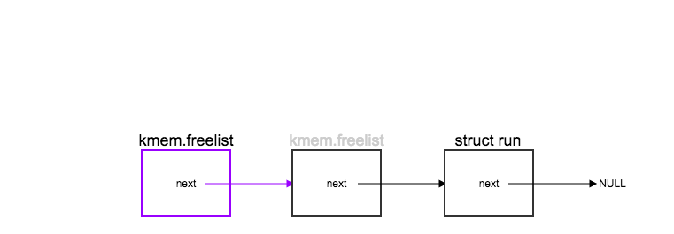
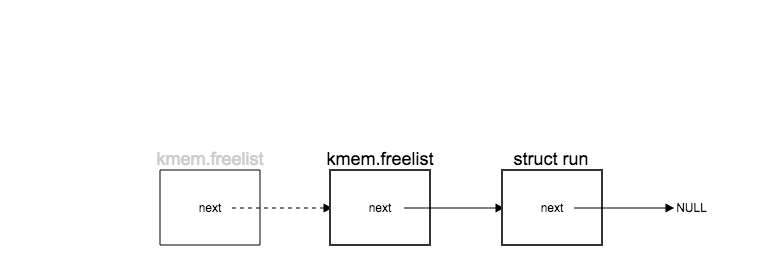
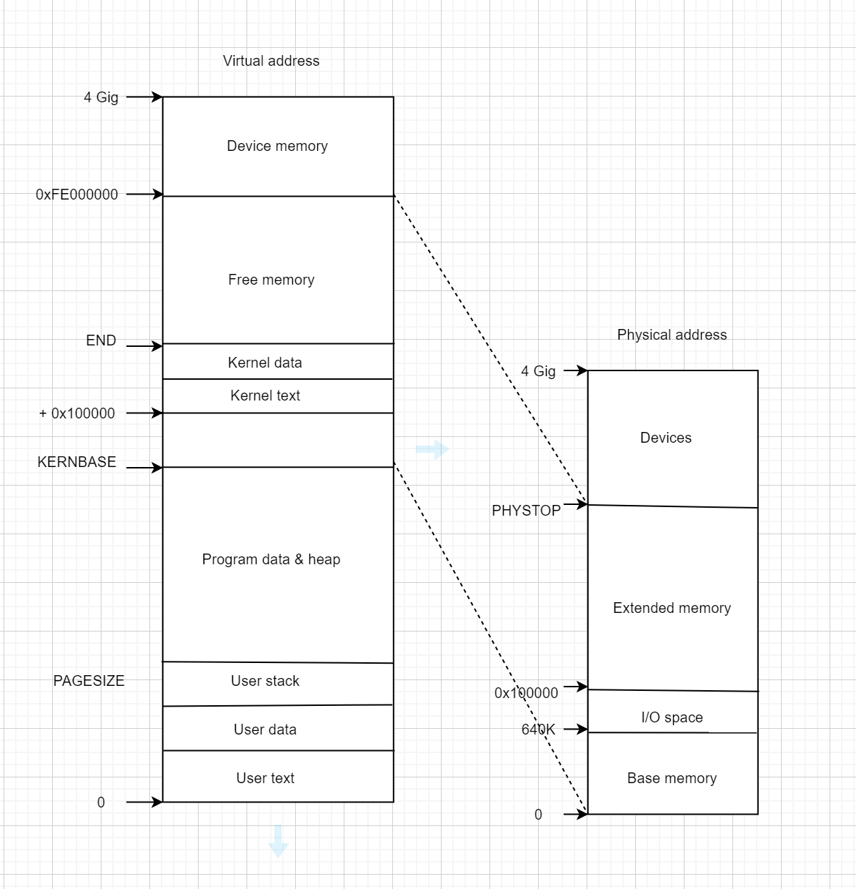
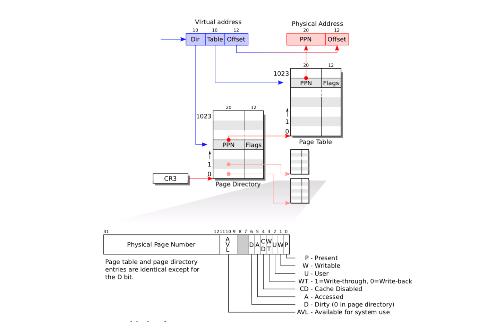

# XV6源代码阅读——虚存管理
**第1组：刘德培、王楚微、谢新宇、周呈华、张宏伟**
- [阅读代码](#----)
  * [kalloc.c](#kallocc)
    + [一些struct](#--struct)
    + [freerange(void *vstart, void *vend)](#freerange-void--vstart--void--vend-)
    + [kfree(char *v)<a id="kfree"> </a>](#kfree-char--v--a-id--kfree-----a-)
    + [kinit1(void *vstart, void *vend) <a id="kinit1"></a>](#kinit1-void--vstart--void--vend---a-id--kinit1----a-)
    + [kinit2(void *vstart, void *vend) <a id="kinit2"></a>](#kinit2-void--vstart--void--vend---a-id--kinit2----a-)
    + [char* kalloc(void)](#char--kalloc-void-)
- [vm.c](#vmc)
    + [kmap](#kmap)
    + [pde_t* setupkvm(void)](#pde-t--setupkvm-void-)
    + [static int mappages(pde_t *pgdir, void *va, uint size, uint pa, int perm)](#static-int-mappages-pde-t--pgdir--void--va--uint-size--uint-pa--int-perm-)
    + [static pte_t * walkpgdir(pde_t *pgdir, const void *va, int alloc)](#static-pte-t---walkpgdir-pde-t--pgdir--const-void--va--int-alloc-)
    + [void switchkvm(void)](#void-switchkvm-void-)
    + [int allocuvm(pde_t * pgdir, uint oldsz, uint newsz)](#int-allocuvm-pde-t---pgdir--uint-oldsz--uint-newsz-)
    + [void freevm(pde_t * pgdir)](#void-freevm-pde-t---pgdir-)
    + [pde_t * copyuvm(pde_t * pgdir, uint sz)](#pde-t---copyuvm-pde-t---pgdir--uint-sz-)
- [问题与思考](#-----)
    + [XV6 初始化之后到执行 main.c 时，内存布局是怎样的（其中已有哪些内容）？](#xv6----------mainc----------------------)
    + [XV6 的动态内存管理是如何完成的？](#xv6---------------)
    + [XV6 的虚拟内存是如何初始化的？画出 XV6 的虚拟内存布局图，请说出每一部分对应的 内容是什么。](#xv6-----------------xv6---------------------------)
    + [关于 XV6 的内存页式管理](#---xv6--------)
- [参考文献](#----)


## 阅读代码
**内存管理部分： kalloc.c vm.c 以及相关其他文件代码**
XV6的内存管理流程主要是：

1. <code>kinit1()</code>
 在main函数中，首先调用kinit1初始化内核部分地址空间
<code> kinit=> freerange => kfree</code>
```c
void kinit1(void *vstart, void *vend)
{
  initlock(&kmem.lock, "kmem");
  kmem.use_lock = 0;
  freerange(vstart, vend);
}
```
2. <code>kvmalloc()</code> <a id="kvmalloc"></a>
调用kvmalloc()对虚存和物理内存建立映射关系
<code>kvmalloc => setupkvm => kalloc=>mappages </code> 设置内核页表，按照kmap定义的映射关系。
<code>kvmalloc => switchkvm => lcr3 => v2p(kpgdir)</code> 把页目录放入cr3寄存器
```c
void kvmalloc(void)
{
  kpgdir = setupkvm();
  switchkvm();
}
```
3. <code> kinit2() </code>
在一系列内核部分初始化结束即内核安装完成后，调用<code>kinit2()</code> 对剩余地址空间初始化。
```c
void kinit2(void *vstart, void *vend)
{
  freerange(vstart, vend);
  kmem.use_lock = 1;
}
```

在以上步骤结束后，内核末尾物理地址到物理地址<code>PHYSTOP</code>的内存空间未使用，虚拟地址空间<code>KERNBASE</code>以上部分映射到物理内存低地址相应位置。  

>XV6中，虚拟地址和物理地址的转化主要通过p2v()和v2p()两个函数。内核代码存在于物理地址低地址的0x100000处，页表为main.c文件中的entrypgdir数组，其中虚拟地址低4M映射物理地址低4M，虚拟地址 [KERNBASE, KERNBASE+4MB) 映射到物理地址[0, 4MB)
- p2v( ) 
给传进来的参数加上基址KERNBASE（转换成指针），使其指向主存的起始地址。（v2p()函数是减去基址。）


```c
#define V2P(a) (((uint) (a)) - KERNBASE)
#define P2V(a) (((void *) (a)) + KERNBASE)
```
- char end[] 
从ELF加载完内核之后的起址

下面对以上调用的具体函数进行说明。

### kalloc.c 

#### 一些struct
**spinlock**  互斥锁
```c
struct spinlock {
  uint locked;       // 锁是否被持有   
  
  // For debugging:
  char *name;        // Name of lock.
  struct cpu *cpu;   // The cpu holding the lock.
  uint pcs[10];      // The call stack (an array of program counters)
                     // that locked the lock.
};
```

**run**  
```c
struct run {
  struct run *next; // 指向下一个空闲页
};
```


<a id = "kmem">**kmem**</a>
```c
struct {
  struct spinlock lock; //互斥锁
  int use_lock;         //是否使用锁
  struct run *freelist;  //空闲内存链表
} kmem;
```
<code>kmem</code>保存着虚拟地址空间上的<code>freelist</code>地址
xv6 用链表表示空闲的物理内存，其中链表头节点是 <code>struct kmem->freelist</code>，链表节点是 <code>struct run</code>，链表的每个节点是空闲页物理内存的起始地址，但是链表存放的是虚拟地址，不是物理地址。


#### freerange(void *vstart, void *vend)
释放start 到 end 的页 ，通过每一页调用kfree.
```c
void
freerange(void *vstart, void *vend)
{
  char *p;
  p = (char*)PGROUNDUP((uint)vstart);
  for(; p + PGSIZE <= (char*)vend; p += PGSIZE)
    kfree(p);
}
```
#### kfree(char *v)<a id="kfree"> </a>
释放 v 指向的物理页

```c
void
kfree(char *v)
{
  struct run *r;
//...
  r = (struct run*)v;
  r->next = kmem.freelist;
  kmem.freelist = r;
  //...
}
```

#### kinit1(void *vstart, void *vend) <a id="kinit1"></a>
- 初始化kmem锁
- 从start 到 end 的地址分配页
#### kinit2(void *vstart, void *vend) <a id="kinit2"></a>
在内核页表安装好后，对剩余的物理页面调用，在此之后给内核映射部分页表加锁。
xv6通过在<code>main</code>函数最开始处释放内核末尾到4Mb的空间来分配页表，由于在最开始时多核CPU还未启动，所以没有设置锁机制。<code>kinit2</code>在内核构建了新页表后，能够完全访问内核的虚拟地址空间，所以在这里初始化所有物理内存，并开始了锁机制保护空闲内存链表。
#### char* kalloc(void)

<a id="kalloc"> </a>
分配一个4K的物理页
```c
char* kalloc(void)
{
  struct run *r;
//...
  r = kmem.freelist;
  if(r)
    kmem.freelist = r->next;
    //...
  return (char*)r;
}
```
xv6使用空闲内存的前部分作为指针域来指向下一页空闲内存，物理内存管理是以页（4K）为单位进行分配的。物理内存空间上空闲的每一页，都有一个指针域（虚拟地址）指向下一个空闲页，最后一个空闲页为NULL.


## vm.c

<code>pde_t *kpgdir</code> ： scheduler()中使用.XV6的每个进程有一个页表，kpgdir仅在scheduler内核线程中使用。内核在系统调用和中断期间使用当前进程的页表。页面保护位可防止用户代码使用内核的映射。
<code>struct segdesc gdt[NSEGS]  ：NSEGS = 7</code>

#### kmap

<a id="kmap"> </a>
```c
static struct kmap {
  void *virt;
  uint phys_start;
  uint phys_end;
  int perm;
} kmap[] = {
 { (void*)KERNBASE, 0,             EXTMEM,    PTE_W}, // I/O space
 { (void*)KERNLINK, V2P(KERNLINK), V2P(data), 0},     // kern text+rodata
 { (void*)data,     V2P(data),     PHYSTOP,   PTE_W}, // kern data+memory
 { (void*)DEVSPACE, DEVSPACE,      0,         PTE_W}, // more devices
};
```

|Define|Addr|content|
|-|-|-|
|EXTMEM | 0x100000| Start of extended memory|
|PHYSTOP |0xE000000 |Top physical memory|
|DEVSPACE |0xFE000000 |Other devices are at high addresses|
|KERNBASE| 0x80000000  |  First kernel virtual address|
|KERNLINK |(KERNBASE+EXTMEM) | Address where kernel is linked|


  setupkvm（）和exec（）设置每个页表，如下所示：

|虚拟地址|物理地址|内容|
|-|-|-|
|0~KERNBASE|内核分配|用户内存（text+data+stack+heap）|
|KERNBASE~KERNBASE + EXTMEM|0~EXTMEM|用于I / O空间|
|KERNBASE + EXTMEM~data|EXTMEM~V2P（data）|获取内核的指令和r/o数据|
|data~KERNBASE + PHYSTOP|V2P（data）~ PHYSTOP|读写数据+可用物理内存|
|0xfe000000~0|直接映射|如ioapic之类的设备|

 内核在V2P（end）和物理内存末尾（PHYSTOP）（可直接从end~P2V（PHYSTOP）寻址）之间为其堆和用户内存分配物理内存。

此表定义内核的映射，这些映射出现在每个进程的页表中。
<a id="memmap"></a>


#### pde_t* setupkvm(void)
设置内核部分的页表 ，通过kalloc分配一页内存作为页目录，然后将按照kmap数据结构映射内核虚拟地址空间到物理地址空间，期间调用了工具函数mappages。
```c
pde_t*
setupkvm(void)
{
  pde_t *pgdir;
  struct kmap *k;
//...
  for(k = kmap; k < &kmap[NELEM(kmap)]; k++)
    if(mappages(pgdir, k->virt, k->phys_end - k->phys_start, 
                (uint)k->phys_start, k->perm) < 0)
      return 0;
  return pgdir;
}
```
#### static int mappages(pde_t *pgdir, void *va, uint size, uint pa, int perm)
从va起始的虚拟地址 到 从pa起始的物理地址 创建页表项 。即建立虚拟地址和物理地址的映射关系，其中调用了walkpgdir。

#### static pte_t * walkpgdir(pde_t *pgdir, const void *va, int alloc)
XV6使用了二级页表，此函数返回二级页表的地址。
```c
static pte_t *
walkpgdir(pde_t *pgdir, const void *va, int alloc)
{
  pde_t *pde;
  pte_t *pgtab;

  pde = &pgdir[PDX(va)];
  if(*pde & PTE_P){
    pgtab = (pte_t*)p2v(PTE_ADDR(*pde));
  } else {
    if(!alloc || (pgtab = (pte_t*)kalloc()) == 0)
      return 0;
    // Make sure all those PTE_P bits are zero.
    memset(pgtab, 0, PGSIZE);
    // The permissions here are overly generous, but they can
    // be further restricted by the permissions in the page table 
    // entries, if necessary.
    *pde = v2p(pgtab) | PTE_P | PTE_W | PTE_U;
  }
  return &pgtab[PTX(va)];
}
```
- 根据虚拟内存的高10位，找到页表是在页目录的第几项，如果页表不存在，新建页表，并设置页表的属性。pde 就是页目录项的虚拟地址，* pde 是页目录项存放的内容，也就是页表的物理地址，pgtab 是转换后的虚拟地址。
- 找到页表后，在根据虚拟地址的中间10位，找到页表项，也就是页存放在页表中的第几项，并返回页表项的虚拟地址。
- 最后在 mappages() 中，将页的物理地址存放到页表项当中

下图是一个地址转换的图例。
<a id = "addrTrans" > </a>


#### void switchkvm(void)
在切换进程时总是需要切换页表，switchkvm把kpgdir首地址保存到cr3寄存器，这样就切换到了新的页表。switchuvm与之不同在于会对cpu的全局描述符 cpu->gdt进行修改。
```c
void
switchkvm(void)
{
  lcr3(v2p(kpgdir));   // switch to the kernel page table
}
```
#### int allocuvm(pde_t * pgdir, uint oldsz, uint newsz)
在设置页表的同时分配虚拟地址oldsz到newsz的以页为单位的内存。而deallocuvm是反过来设置对应虚拟地址为空闲

#### void freevm(pde_t * pgdir)
当进程销毁需要回收内存时，调用void freevm(pde_t * pgdir)清除用户进程相关的内存环境，其首先调用将0到KERNBASE的虚拟地址空间回收，然后销毁整个进程的页表

#### pde_t * copyuvm(pde_t * pgdir, uint sz)
负责复制一个新的页表并分配新的内存，新的内存布局和旧的完全一样，xv6使用这个函数作为fork()底层实现。


## 问题与思考
####  XV6 初始化之后到执行 main.c 时，内存布局是怎样的（其中已有哪些内容）？ 
 内核代码存在于物理地址低地址的0x100000处，页表为<code>main.c:entrypgdir[]</code>，其中虚拟地址低4M映射物理地址低4M，虚拟地址<code> [KERNBASE, KERNBASE+4MB) </code>映射到 物理地址<code>[0, 4MB) </code>
最后内存布局和地址空间如下：内核末尾物理地址到物理地址<code>PHYSTOP</code>的内存空间未使用，虚拟地址空间<code>KERNBASE</code>以上部分映射到物理内存低地址相应位置。

#### XV6 的动态内存管理是如何完成的？ 
由第一部分源码阅读可知：有一个 <code>kmem</code>（链表），用于管理可分配的物理内存页。回顾[kmem](#kmem)（vend=0x00400000，也就是可分配的内存页最大为 4Mb）

同代码阅读；

####  XV6 的虚拟内存是如何初始化的？画出 XV6 的虚拟内存布局图，请说出每一部分对应的 内容是什么。 

(1)main函数通过调用

[kinit1(void * vstart, void * vend)](#kinit1)
[void kinit2(void * vstart, void * vend)](#kinit2)
 [void kvmalloc(void)](#kvmalloc)
  函数来实现内核新页表的初始化。

(2).[内存布局](#memmap)

#### 关于 XV6 的内存页式管理
- 发生中断时，用哪个页表？
发生中断时，将换入cpu的进程的页表首地址存入cr3寄存器
- 一个内页是多大？页目录有多少项？页表有多少项？最大支持多大的内存？
    - 一个内存页为**4k**
    - XV6页表采用的二级目录，一级目录有 2<sup>10</sup>条，二级目录有2<sup>10</sup> * 2<sup>10</sup> 条
    - 页表项为2<sup>2</sup>Bytes，故页表有2<sup>10</sup> = 1024项
    - 最大支持4G内存
- 画出从虚拟地址到物理地址的转换图。
    - [地址转换图](#addrTrans)
- 在 XV6 中，是如何将虚拟地址与物理地址映射的（调用了哪些函数实现了哪些功能）？
  物理内存页的申请与释放，虚拟地址与物理地址如何映射等在源代码阅读部分参见：
    - [kmap](#kmap)
    - [kalloc](#kalloc) 
    - [kfree](#kfree).


## 参考文献
1. [xv6 risc-v 虚拟内存 code walk through](https://blog.csdn.net/redemptionc/article/details/107709618)
2. [XV6源代码阅读-虚拟内存管理](https://blog.csdn.net/qq_36347375/article/details/91354467)
3. [XV6 - Virtual Memory](http://linbo.github.io/2017/10/01/xv6-vm)

